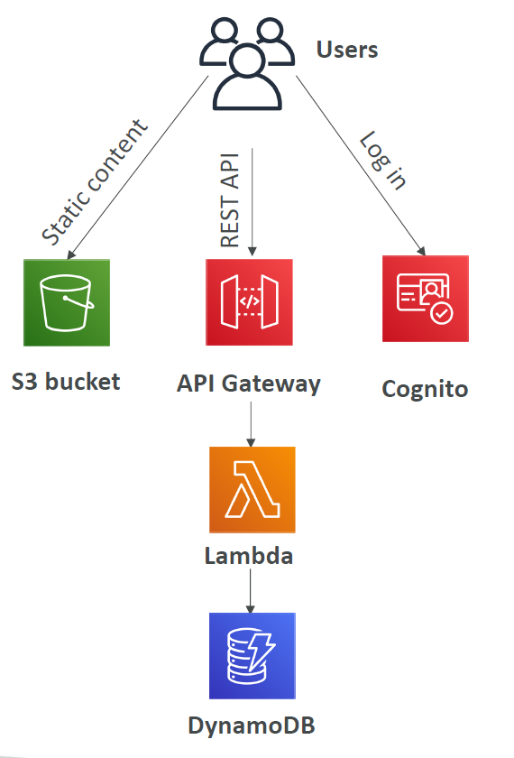
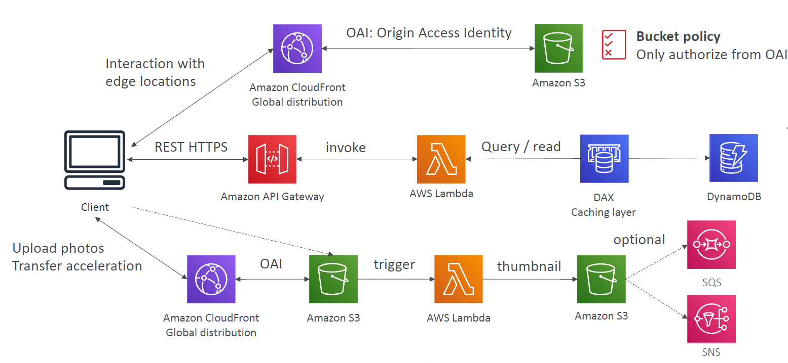
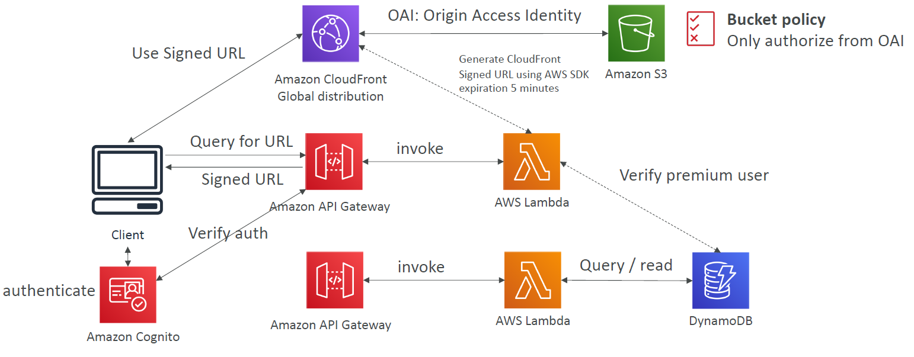
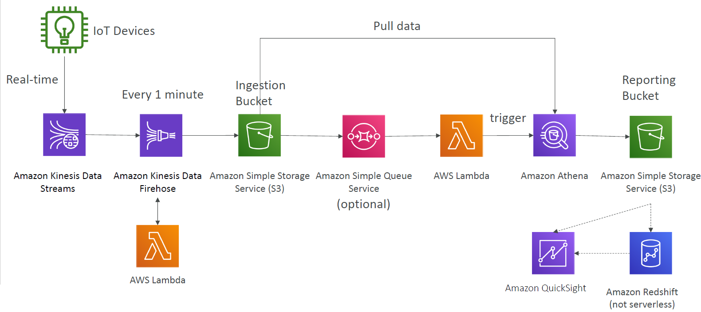

# Serverless

Architecture where you dont manage servers (i.e. VMs / EC2 instances).

Products where you dont manage servers are are follows:

- Lambda functions
- DynamoDB
- RDS
- etc.

Basic serverless architecture is as follows:

## Examples

### To Do List App

Classic Serverless REST API Application that includes:

- API
- Database
- File Storage
- Authentication

### My Blog

Extended example with 
- file uploads
- thumbnail generation
- global static files

### Distribute Premium Video Content

Entended example with:
- premium user generation
- authenticated video hosting with signed URLs
- global video distribution

### Big Data Pipeline

Serverless data pipeline architectural example.

