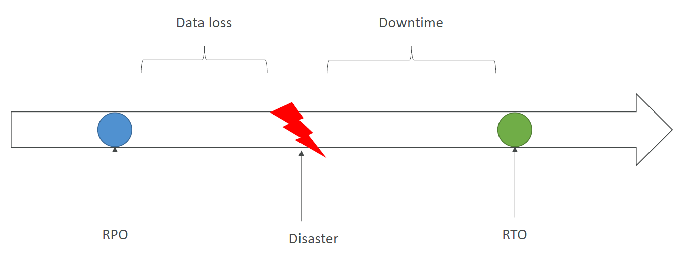
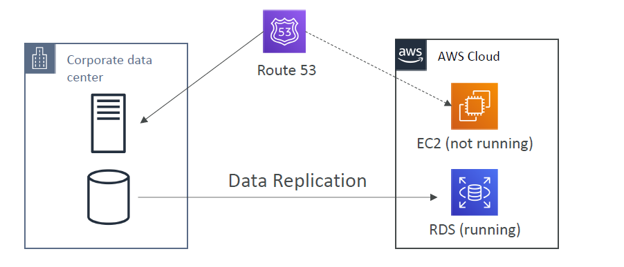
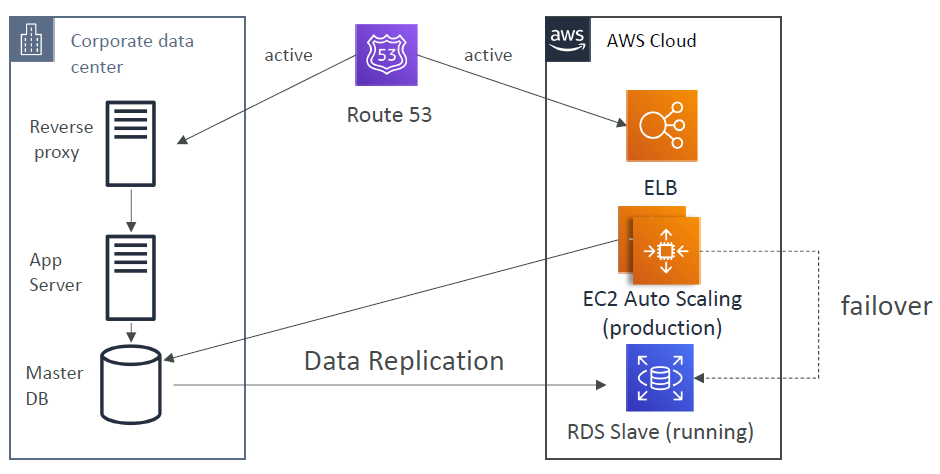
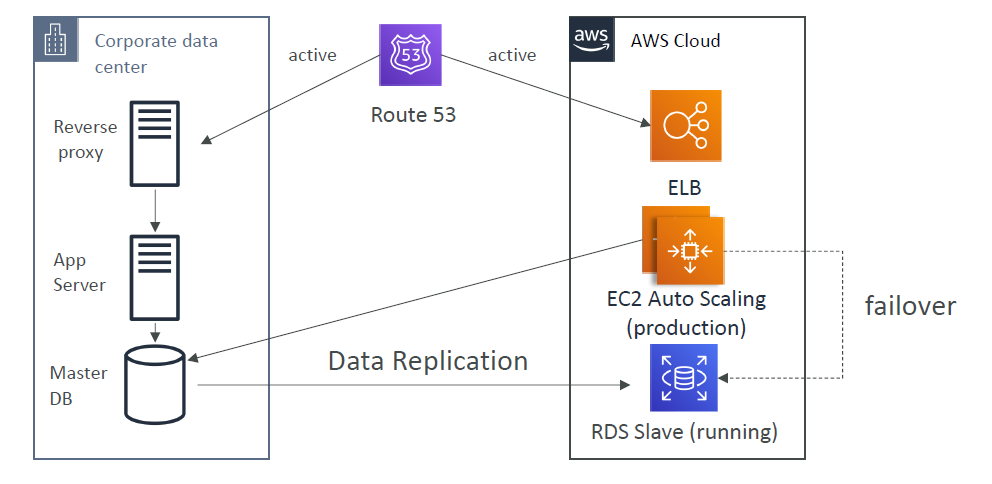

# Disaster Recovery

Any event that has a negative impact on the company's business or financies.

3 types of infrastructure scenarios this applies to:
- On-premise
- AWS Cloud: hybrid
- AWS Cloud: regions

Two key terms need to be understood:

Recovery Point Objective (RPO) - Minimum time between last backup and disaster
Recovery Time Objective (RTO) - Maximum time between disaster and everything being fixed

## Strategies

### Backup and Restore

Take regular backups based on your IT infrastructure. 

Example 1 - already in the cloud, take snapshots on regular intervals.
Example 2 - on premise data. Send data to cloud via public internet of snow family and backup to S3 / glacier.

### Pilot Light

Always have the core of your application running in the cloud. i.e. the bare minimum resources required to run your app.

### Warm Standby

duplicate full system always up and running but at minimum size. So if disaster happens you can swap over.

### Hot Site / Multi Site Approach

Full Production Scale is running on AWS.

All strategies can also be applied to IT infrastructure running only on the cloud, however the replication is cross region.

## Testing

Chaos Testing can be applied to test the disaster scenarios.