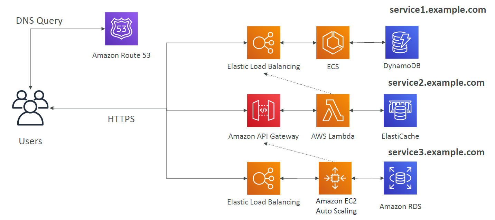

# Microservices Architecture

Many services communicating with each other via web APIs.

Each service can differs in architecture and structure.

Best explained by the diagram below.

General architectures for each service are:
- Container based
- serverless
- Classic managed VMs

Benefits:
- Can package up each service to faster development cycles.