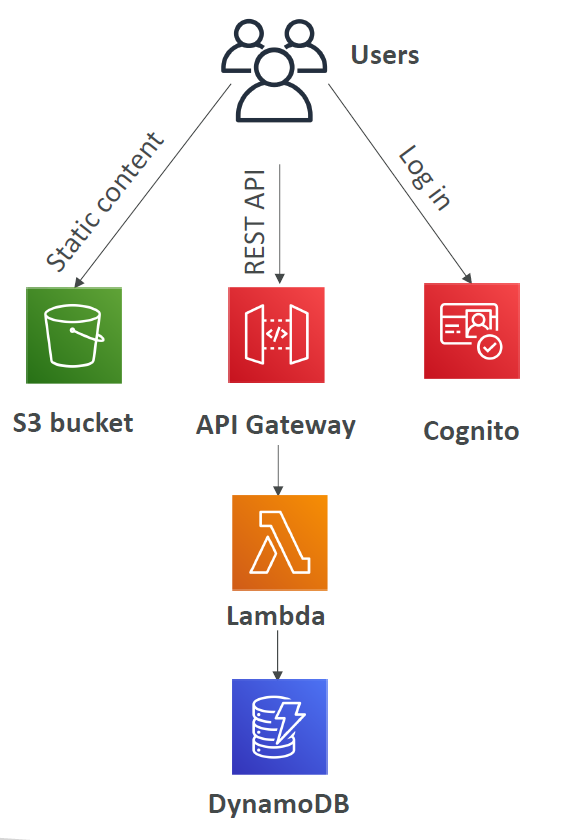

# Serverless

New paradigm where you dont have to manage servers anymore (i.e. VMs / EC2 instances).

Includes anything where you dont mange the server for examaple:

- Lambda functions
- DynamoDB
- RDS
- etc.

## Architecture

Best displayed by the diagram below:

