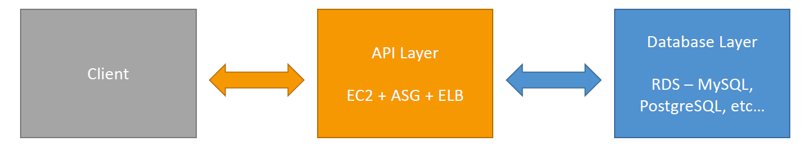
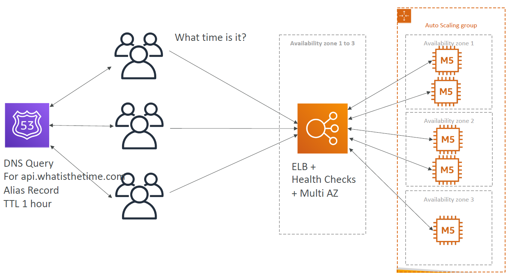
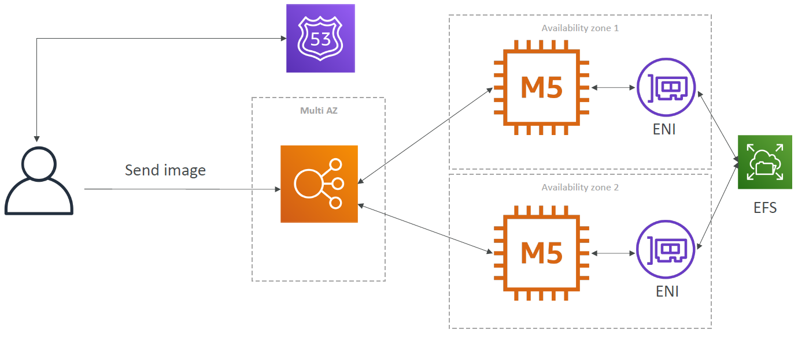

# Standard Application Architecture

3 Tier Web Application is a standard architecutre used for many applications.

This can also be thought of in the following way:

## Example Architectures

### Whatisthetime.com

### Myclothes.com

### Mywordpress.com

+ Amazon Aurora or RDS for database storage