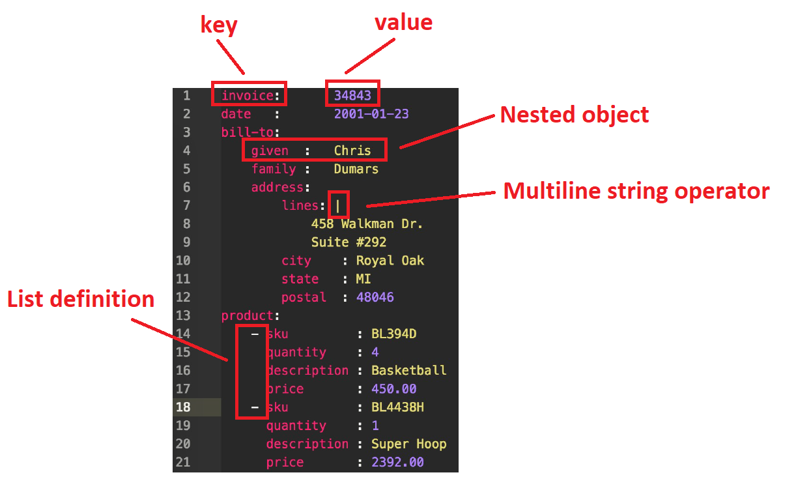
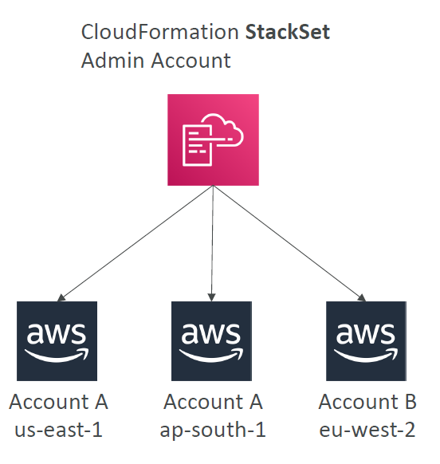
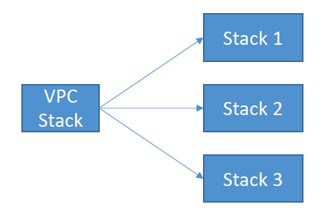

# Cloud Formation

AWS infrastructure/services as code. 

Notes:
- Declarative (you say what you want and cloud formation figures out how to do it)
- Defined as a .yaml file 

## Supported Services

Supports all of aws services and resources (bar a few niche items).
- lambda
- codebuild
- codepipeline
- EC2
- etc.

## Languages

Supports YAML and JSON for templates.

## YAML

A format for defining data which is comprised of key and value pairs. Where a key can be an objects and a value can be an object.

A excellent overview of a yaml file is shown below.



## YAML Templates

Templates have 7 key areas remembered as 
```
MR. COMP
```

1. (M)appings
2. (R)esources

3. (C)onditionals
4. (O)utputs
5. (M)etadata
6. (P)arameters

Templates also have 2 helper areas:
1. References
2. Functions

### (M)appings

Static variables defined as a map directly in the YAML file.

### (R)esources

Aws resources used. Format as follows:

```
AWS::aws-product-name::data-type-name
```

### (C)onditions

Conditional statement executions.

```yaml
Conditions:
    CreateProdResources: !Equals [ !Ref EnvType, prod ]
```

Sample functions which can be used for conditionals are as follows:
```yaml
!If
!Not
!Equals
!And
```
etc.

### (O)utputs

Optional values which can be output from CloudFromation stacks after they are created.

These can then be referenced by other stacks by using the following function.

```yaml
!ImportValue
```

### (M)etadata

data about data.

### (P)arameters

```
A variable something that changes or that can be changed
```
```
A Parameter is a variable in the declaration of a function: functionName(parameter) { // do something }
```
In this context it is a value which is dynamically passed to a template.

Can be referenced by using the !Ref function. Example parametes might include:
- region
- VPC
- etc.

```yaml
Properties:
    VpcId: !Ref MyVPC
```

### Intrinsic Functions

Functions that are built into Cloud Formation.

```yaml
!GetAtt
```

Used to get attributes from a resource defined in your yaml template e.g. an EC2 instance created.

```yaml
!FindInMap
```

Look up a value in a mapping defined in the yaml file.

```yaml
!Sub
```

subsitute values.

## Stack Types

### Stack Sets

Stacks that are applied across multiple accounts and regions.



### Change Sets

When you update a new cloud formation template version, you can see what changes will happen before you run the template. This is called a Change set.

### Nested Stacks

Stacks that are used as parts of other stacks.

e.g. load balancer configs, security group configs.


### Cross Stacks

Stacks that are reference across other stacks. e.g. a VPC.



## Rollbacks

On stack update/creation fail. Everything will be rolled back to the previously known state/deleted.

## CloudFormation Drift

```
A drift is a manual configuration change to cloud formation resources.
```

These can be detected with CloudFormation drift. Simple use the View Drift function.

## Cloud Designer

**You can see a visualisation of the infrastructure by looking at cloud designer**