# Lambda

Serverless functions that run on demand.

- Scaling is automated.
- supports basically any language and even containers!!
- Extremely cheap
- Has a whole bunch of blueprints for common operations...

# Basic Operation Overview

- **Create**: the function in your local IDE
- **Compile**: .zip your code AND installed dependancies (e.g. node_modules folder)
- **Upload**: to to lambda 
- **Invoke**: lambda function by passing through events

# Environment Variables

```
Allow you to adjust function behaviour without updating code.
```
Can be used to store secret values which are encrypted by KMS.

# Invocation

Lambda supports the following two types of invocation.

## Synchronous

```
Invoke a lambda function and wait for the response
```
Examples include invoking via the CLI, SDK, API Gateway or an ALB.

## Asynchronous

```
Invoke lambda functions and dont wait for the response. 
```
Examples include invoking with S3 object upload notifications, SNS or CloudWatch events.

# Passing Events

```
You have to specificially pass events to lambda functions
```
This is done in the following ways

## Synchronous

### Lambda and HTTP

To expose Lambda functions over HTTP you have two options:

- ALB
- API Gateway

This works as follows

- HTTP request sent to load balancer
- Load balancer recieves request on route (/, /api, /docs, etc.) 
- Load balancer parses request to JSON
- Lambda function assigned to target group
- Request passed to to target group
- Lambda recieves JSON event
- Lambda process event and returns JSON response
- Load balancer converts JSON to HTTP
- HTTP sent to client

A sample lambda function returning the correct JSON response to a load balancer is provided below:

```javascript
import 'json';

def lambda_handler(event, context): 
    // lamda functions must return json objects in format 
    // required by ALB / API Gateway for these services to 
    // be able to process the reponse
    return {
        "statusCode": 200,
        "statusDescription": "200 OK",
        "isBase64Encoded": false,
        "headers": {
            "Content-Type": "text/html"
        },
        "body": "<h1>Hello from lambda!</h1>"
    }
```

#### Multi-Header Values

```
when query string parameters are assigned multiple values
```
When supported is enabled in lambda multi-header values are passed through as arrays.

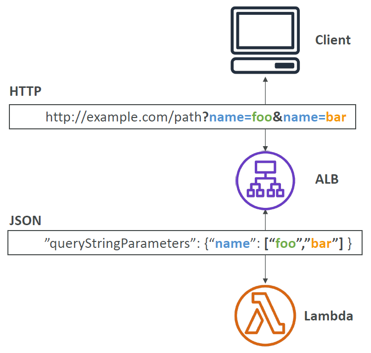

## Asynchronous

### CloudWatch Events / EventBridge

- CRON EventBridge rule - Pass an event on a schedule
- CodePipeline EventBridge Rule - Pass an event on pipeline execution

### S3 Event Notifications

- create bucket
- create event notificaton (follow ui steps)
- specifiy event destination as lambda function

### Event Source Mapping

Specify an event source for a lambda function. Lambda will then poll this source for events.

Sources are as follows:
- SQS
- SNS
- Kinesis data streams

Process for polling from a source is as follows:

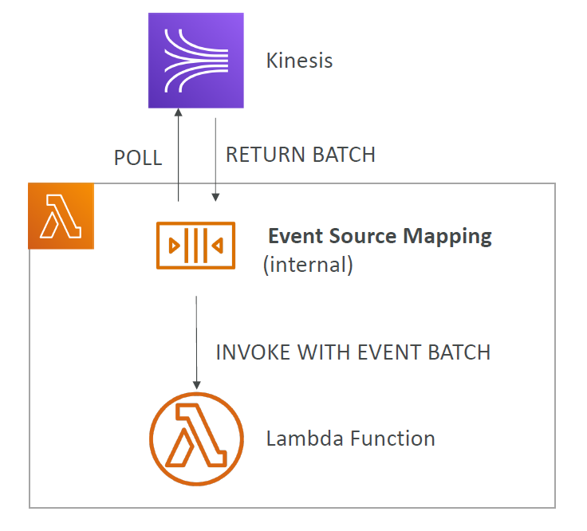
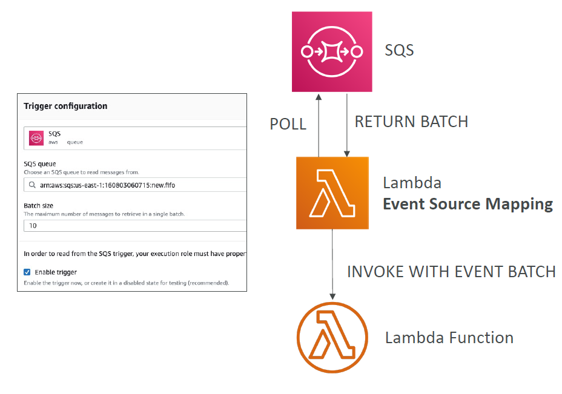

### Kinesis Data Stream Event Sources

Processing steam shards is as follows:

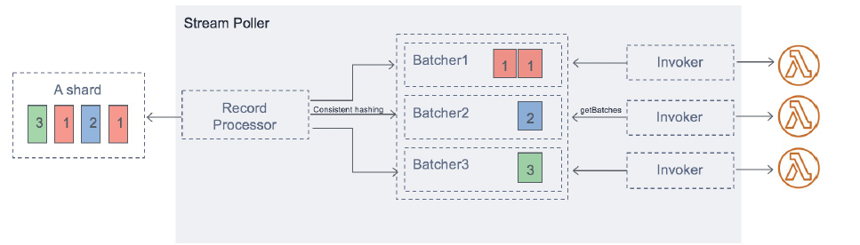

You have the following options with reading the stream of data
- From beginning
- From timestamp
- New items only

# Outputting Results

Since Asynchronous invocations dont get a response you have the option to send results somewhere.

## DLQs

DLQs for failed invocations.

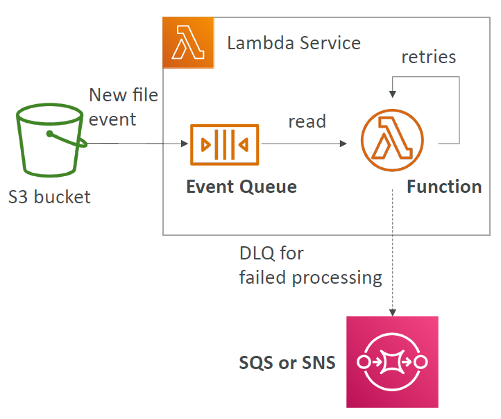

## Destinations

Destinations support failed and successful function invocations and multiple destinations for each result type.

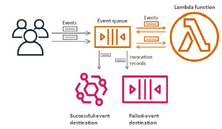

It is recommended is that you use destinations instead of DLQs.

## Failures

Default configuration for function failures is 3 retries then send to failed destination.

# Dependancies

## Intrinsic

AWS_SDK comes packaged with every function

## Lambda Layers

Packaged up re-useable code that can be used accross lambda functions.

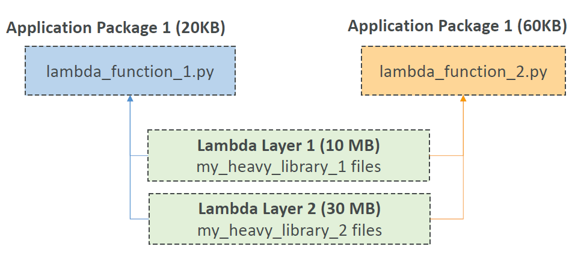</img>

# Containers

Container image must implement the lambda runtime API.

# Security 

## IAM (Execution) Roles

Assigned to lambda function to give it permissions to do stuff. 

Best practice is one role per lambda function.

## (Resource Based) Policies

Assign a policy to a service to give it permission to do stuff. Just like you would to a user.

This is how we grant other accounts and services the ability to invoke your lambda functions.

E.g. Give cloudwatch a resource based policy to invoke lambda.

# Monitoring

## Logging 

lambda will auto log to cloud watch logs

## Metrics

Metrics are displayed in CloudWatch Metrics

Default metrics are as follows:
- Invocations, durations, concurrent executions, error count, success rate, throttles etc.

# Performance

## Execution Context

Temporary runtime environment that initialises any external dependancies of your code.

The execution context is effectively the area outside of your lambda function definition. Place database connections and any other reusable functionality here to only run it on cold starts and avoid running it on each invocation.

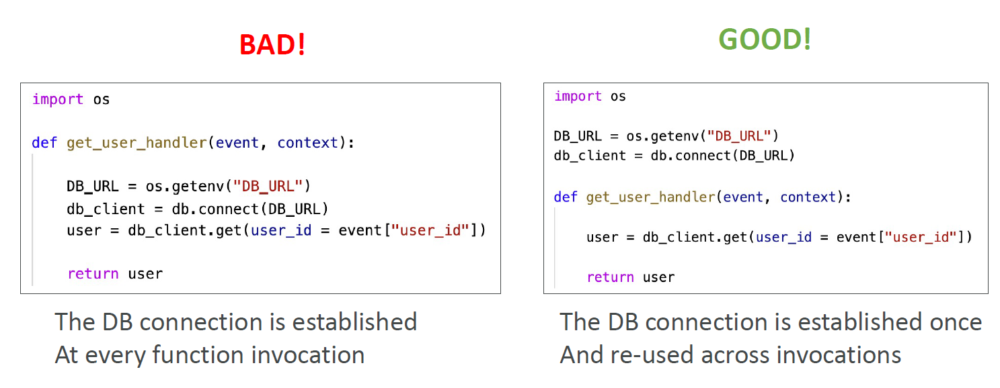

```
Cold Start - when function is first started.
```

## /tmp Directory

Directory in your lambda function that remains even when the execution context is frozen. Only temporary storage.

## Concurrency

```
Concurrency is the maximum amount of lambda executions that can be running for ALL functions in your account.
```
Reserved concurrency is the limit and reservation of concurrent lambda executions for specific function.

Provisioned concurrency is concurrency allocated before function invocation.

## Throttling

Invocations over the concurrency limit will result in a throttle action:
- Synchronous - returns a Throttle Error
- Asynchronous - retries automatically (using expontential backoff) for up to 6 hrs. After which throttle will be sent to a DLQ.

# Deployment

## CloudFormation

Lambda function must be stored as as S3 object with versioning enabled.

CloudFormation can then point to this S3 object it is templates.

## Versioning

Version = Code + Configuration

## Alias
```
an alternative name that refers to an item
```
In this case it is a record that can refer to a lambda function with a traffic weight property.

Notes:
- Alias cannot reference alias.

## Green/Blue Deployments

structured as follows:

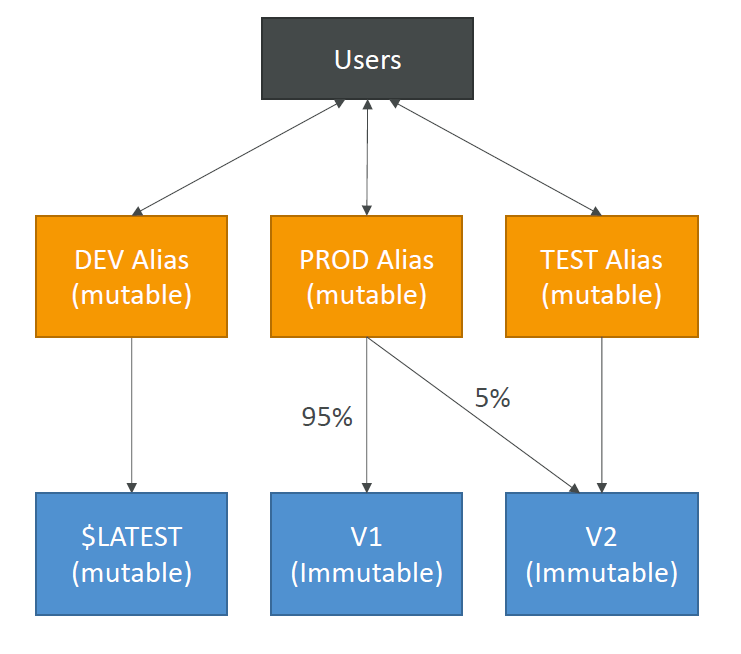</img>

## CodeDeploy

Helps you automate green/blue deployments by automating weight value changes for lambda aliases.

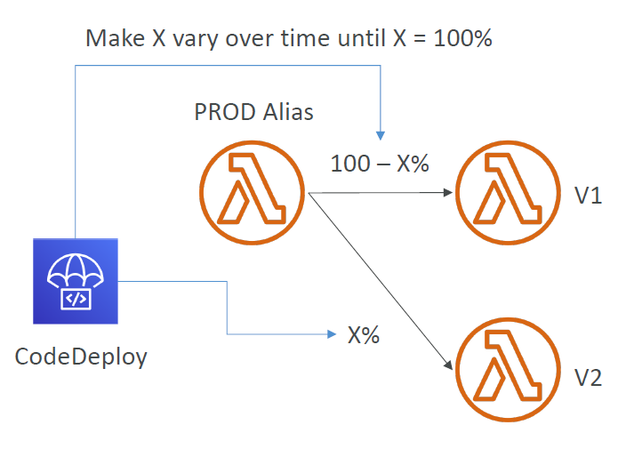</img>

Can be done in the following ways:
- Linear: grow traffic every N minutes until 100%
- Canary: try %5 then 100%
- AllAtOnce: immediate

## Limits

Effectively you can run anything you want as the limitations are very generous.

- Memory: 128MB - 10GB (increasing RAM also improves CPU and network quality)
- Max Execution time: 900 seconds
- Environment variables: 4KB
- Disk Capacity: 512MB
- **Concurrency: 1000** - you can raise this by contacting AWS support
- Compressed deployment size: 50MB
- Uncompressed "": 250MB
- Timeout: 180s default, 900s max

## Languages Supported

- JavaScript
- Java
- C#
- Go
- Python
- Ruby

## Architecture 

### Lambda at Edge

Deploy lambda functions at clound front locations.

Note: can modify request / responses on send and recieve totaling 4 events.

### Lambda VPC

By default, Lambda functions always operate from an AWS-owned VPC and hence have access to any public internet address or public AWS APIs.

Once a Lambda function is VPC-enabled, it will need a route through a NAT gateway in a public subnet to access public resources.

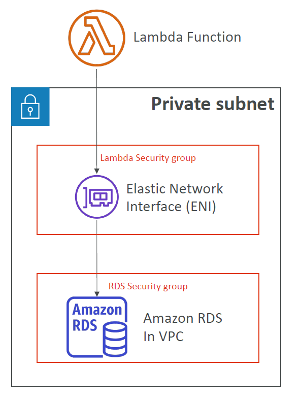</img>
