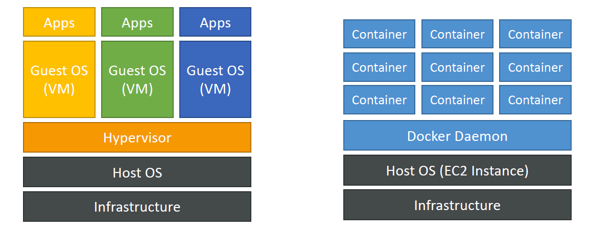
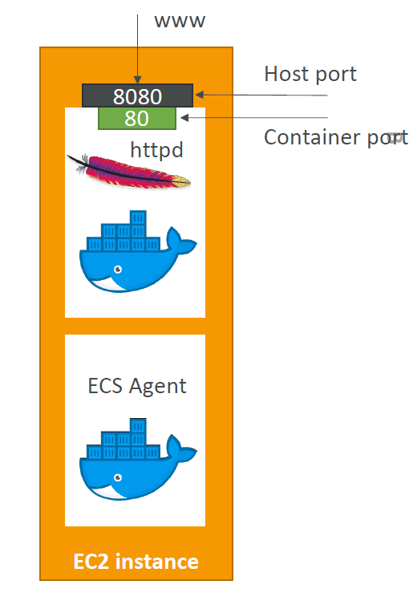

# Docker

Is "sort of" a virtualisation technology. Where resources are shared with a host.

This results in a huge decreases in resources consumed compared to a Virtual Machine (VM).

Benefits:
- Run any app on any OS.

Under the hood Docker runs on the Containerd platform.

## Structure

Docker works at a very high level as per the folloiwng diagram:

## Daemon

Daemon is a computer program that runs as a background process.

## Port Mapping

