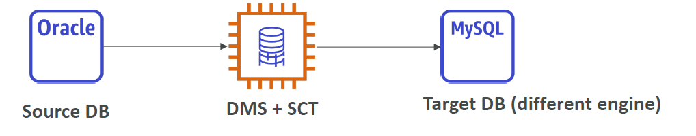

# Database Migration Service (DMS)

Quickly migrate database to AWS cloud.

Supports:
- S3 as a database engine
- AWS database technologies as sources
- Continuous replicatation
- Consolidation into a single destination

## Schema Conversion Tool (SCT)

Tool to parse one data base engine to another. e.g. MySQL to postGres etc.

*Do not need to use SCT if you are using the same DB engine. Only for different engines.*

