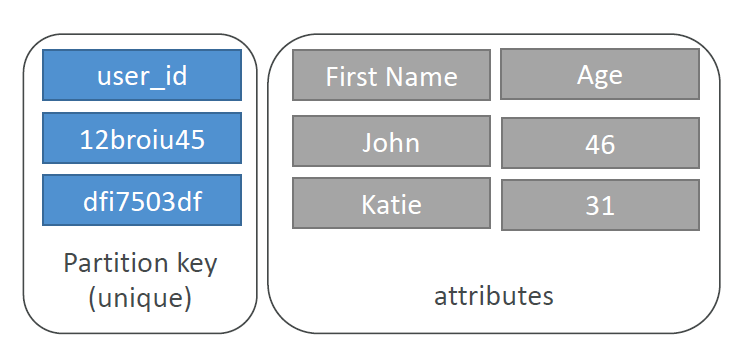
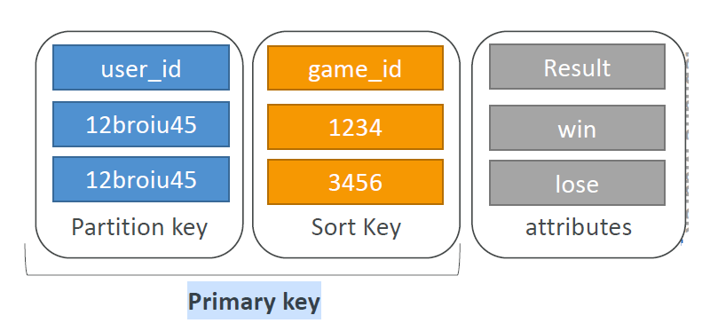
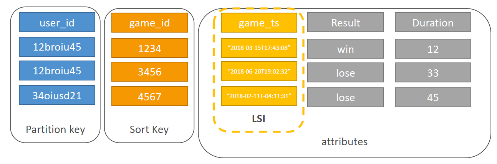
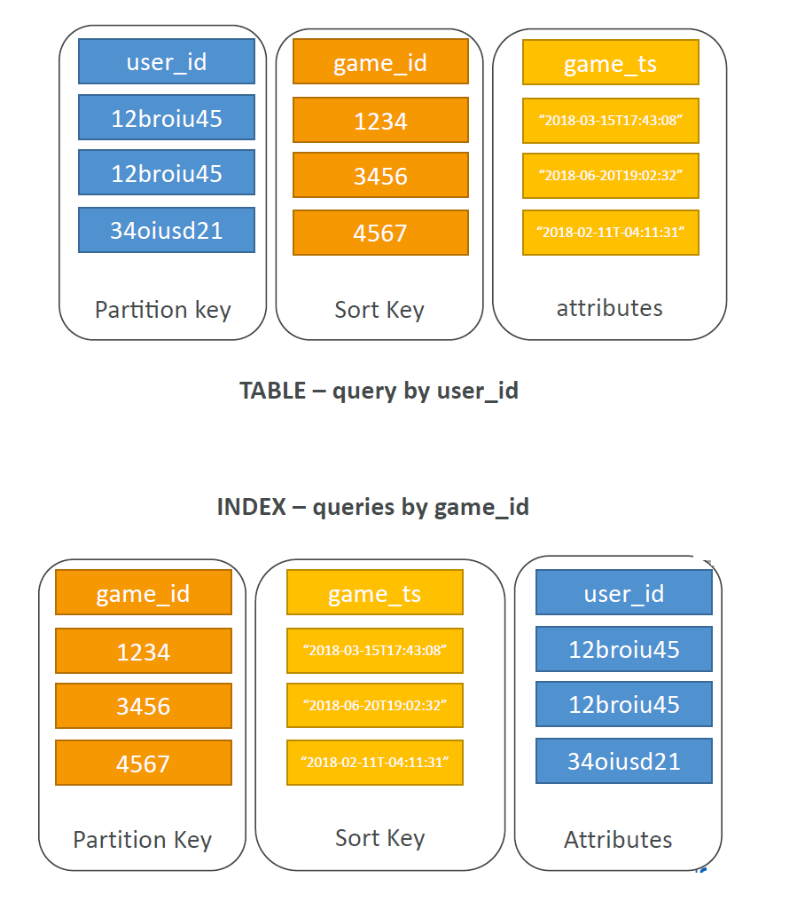
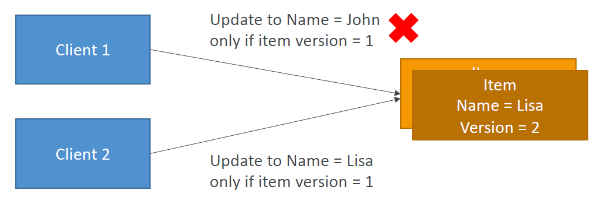
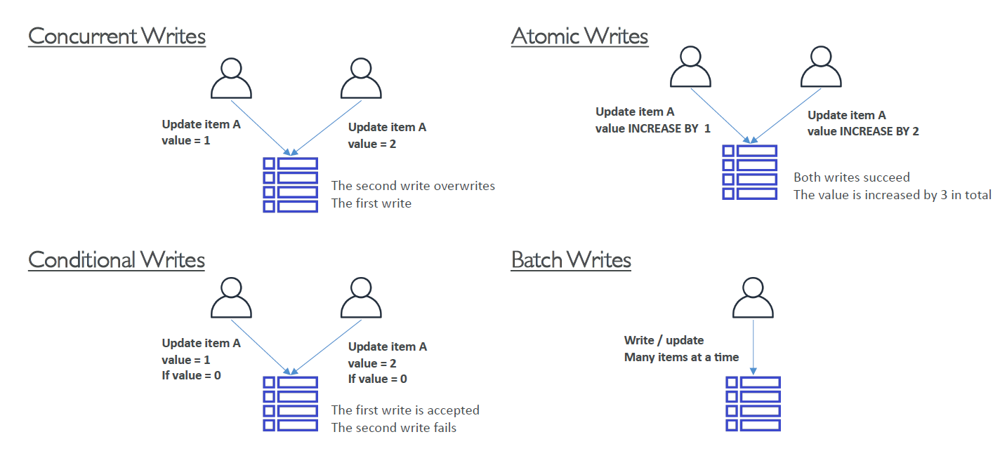
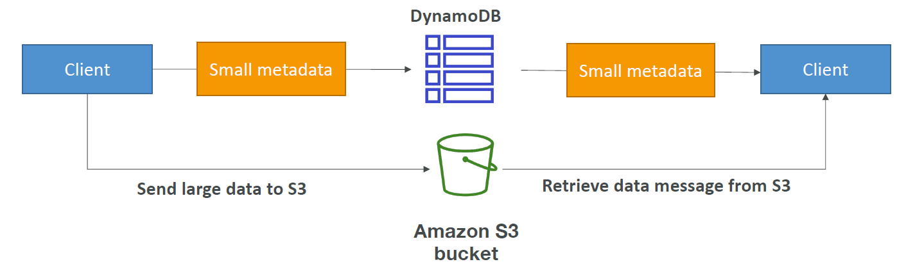

# DynamoDB

NoSQL (Not Only SQL) serverless database.

These databases are generally refered to as **key value** databases. Where a key and a value can be either a value OR an object.

## Data Structure

Data is organised into tables which are comprised of items.
Tables = Rows of data = Collections of objects
Item = Row = Object
Attributes = columns in item = properties

```
attribute = a quality or characteristic that someone or something has.
```
```
property = an attribute, quality, or characteristic of something.
```

## Items 

### Primary Keys

The unique identifier (Primary Key) of a row is refered to as a **Partition key** (because the data in a NoSQL database is distributed over partitions).

Keys should be selected based on cardinality.

```
Cardinality is a measure of the "number of elements" of the set.
```

i.e. user_id has a high cardinality because it has the highest number of unique possibilities.

There are two options for primary keys as follows:

- Partition key only (HASH)



- Partition key AND sort key



## Indexes

```
An index is simply another table sorted on multiple fields. With a pointer to the record it relates to.
```

Indexing allows binary searchs of log2 N complexity to be performed on them. Avoiding an entire table scan.

In addition to the main index on the primary key. Additional indexes can be created for tables. 

## LSI (Local Secondary Index)

Second index LOCAL to the partition key. Must be a scalar value.

```
Scalar - having only magnitude (size), not direction.
```

When an LSI is created an ordered list of the primary key and LSI is created. As follows:

</img>

Notes:
- Uses RCU and WCU of main table.

## GSI (Global Secondary Index)

A GSI is a whole new index (parition key + optional sort key).

</img>

Notes:
- requires its own RCU and WCU.
- If the writes are throttle on the GSI, this causes a throttle on the main table... i.e. you are accessing the data via the GSI so its WCU/RCU take prescedence. 

## Concurrency / Conditionals

Concurrency is when users are accessing the same item in a database at the same time. In simple terms user 1 attempts to write item 1 which takes 10ms. During this timeframe another user attempts to write to it.

To handle this DynamoDB supports **conditional writes**. Which is to only accept a write if conditions are met.

This conditional support makes DynamoDB an optimisic locking / concurrency database.

An example of a conditional to handle concurrency would be an item version condition as follows:



## Write Types

</img>

# Costing

## Automatic

OnDemand Capacity can be specified to scale as needed.

## Manual (Provisioned Throughput)

Read Capacity Units (RCUs) and Write Capacity Units (WCUs) used for costing.

These are spread evenly across partitions.

### Read Capacty Units (RCU)

One strongly consistent read/s OR two eventually consistent reads/s for items up to 4KB in size.

```
Eventually Consistent Read will be eventually consitent with writes. This is the default setting.
```
```
Strongly Consistent Read always get the correct data after a write.
```

Example 1: 10 **strongly consistent** reads per second of 6KB each 
    = 10 * (6/4 = 2) = 20 RCUs.
Example 2: 16 **eventually consistent** reads per second of 12KB each 
    = 16/2 * 12/4 = 24 RCUs.

### Write Capacity Units (WCU)

One write/s for a item 1KB in size.

Example 1: we write 10 objects per second of 2KB each = 2 * 10 = 20WCU.

Example 2: we write 6 objects per second of 4.5KB each = 5 * 6 = 30WCU.
(decimals are always rounded up)

### Throttling

If the the RCU or WCU is exceeded it will result in a throttle error as follows:

ProvisionedThroughputExceeded

This error can be handled as follows:
- Exponential backoff
- Distribute partition keys
- DAX

## Operations (APIs)

Are grouped as Create, Read, Update, Delete (CRUD) operations. These are all very verbose and therefore do not require detailed descriptions.

### Read

Support the following:
```
ProjectionExpression - Only get certain attributes.
```

### Batching

```
BatchWriteItem - Up to 25 PutItem and/or DeleteItem in one call
```
Saves in latency. i.e. one call instead of 25 and DynamoDb does the paralellism for you.

Batch writes can fail. In which case YOU have to perform the retries using exponential backoff.

```
BatchGetItem - Up to 100 items.
```

### Queries

- ParitionKey must be =
- SortKey value (=, <, <=, >, >=, between, begin)
- FilterExpression for further filtering (client side)
- Returns up to 1 MB of data

### Scans

Search entire table then filters out data (inefficient)

Parallel scan can be used to improve performance.

- Returns up to 1 MB of data

## DynamoDB Streams

Change events in DynamoDB (Create, Update, Delete) are added to the DynamoDB stream.

Options of data to be written to the stream are as follows:
- KEYS_ONLY
- NEW_IMAGE - new item
- OLD_IMAGE - old item
- NEW_AND_OLD_IMAGE

Notes:
- Made of shards. Just like kinesis data streams.
- 24 hrs of data rentention

### Transaction

Ability to Create / Update / Delete multiple rows accross multiple tables at the same time.

All or nothing style operation.

Useful to keep data in sync across tables. e.g. the user_id or adding a bank deposit of 100 to one table and updating the balance in another.

### Transactional Capacity Computations

Transactions consume **twice** the RCU and WCU as normal operations.

Example 1: 3 item writes per second @ 5KB in size
= 3 x 5 x 2 = 30 WCU

## TTL (Time To Live)

Automatically delete an item after a specified about of time.

## Large Objects Pattern

</img>

## Copying DynamoDB Tables

- AWS Data Pipeline in combination with EMR is used.
- Create a backup and restore to new table
- Scan of table and write to new table

## Security

Limit access to data in your tables in the following ways:

- Row Based: by specifying a LeadingKey = cognito user id in IAM Policy
- Column Based: Can also specifiy attribute access

## DAX

DynamoDB accelerator via a seamless cache.

Caches individual objects, queries and scans. If additional functionality beyond this is required. Elasticache should be used instead.

- dramatically improves the performance of your db
- enables microsecond latency!
- solves the hot key problem
- 5 min TTL default

## Global Tables

i.e. Cross region replication
