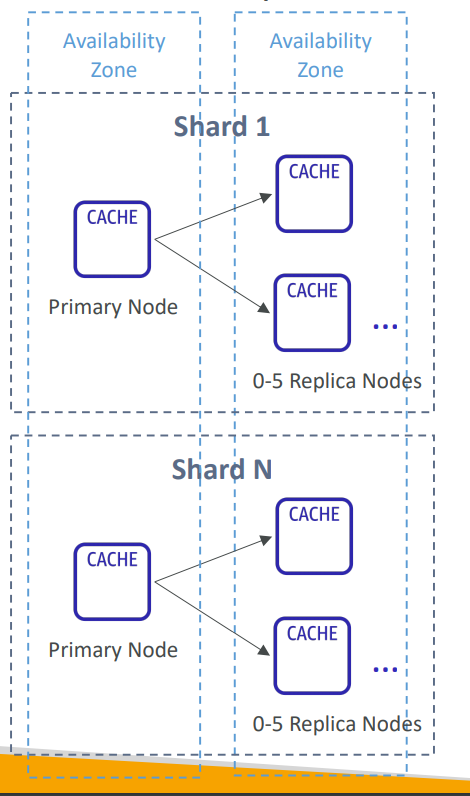

# ElastiCache

AWS service to manage in-memory databases. Such as redis or memcached.

It is a key and value store.

Notes:
- Super high performance and low latency database.
- Can be used to reduce load of databases for read intensive workloads.
- Does not support IAM authentication.

Uses:
- Good for a session store.

## REDIS

Highly available db cache technology.

Similar feastures to AWS RDS including: 
- Multi AZ
- AutoFailover
- Backup and restore features

Supports Redis Authentication.

### REDIS Replication

Two Types:
- Cluster Mode Disabled
- Cluster Mode Enabled

#### Cluster Mode Disabled

#### Cluster Mode Enabled

Sharding a method of splitting and storing a single logical dataset in multiple databases.

## Memcached

High Performance db cache technology.

- No high availability
- no backup and restore

## Strategies

### Lazy Loading / Cache-Aside / Lazy Population

Lazy loading is the practice of delaying load or initialization of resources or objects until they're actually needed.

In the case of elasticache the practice of only fetching data from database if it is not already in the cache.

### Write Through

When you write to the database it is also written to the cache. Therefore cache is always up to date.

### Cache Evictions and Time to Live (TTL)

Removes data out of the cache.

