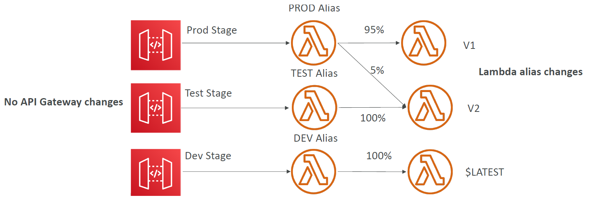

# API Gateway

Serverless API service. Create and manage web APIs.

Supports APIs of type:
- REST API
- HTTP API (low cost version of REST API)
- Websocket API

APIs can pass requests to 
- Any AWS service via its API
- Any custom HTTP endpoints

General features:
- authentication
- request throttling
- swagger support 
- openAPI (industry standard for REST API design) support
- caching

## Stages And Stage Variables

API gateway configuration is created. Then this configuration is deployed to a stage.
```
https://www.some_domain.com/stage/base_api_configuration
```
These stages can pass stage variables to the underlying configuration to customise it. For example sending a resource to differing lambda aliases.

</img>

## API Endpoint Types

- Edge Optimised via CloudFront
- Regional
- Private - accessed via VPC

## Server Side Integration Types

When connecting your API gateway to backend services you have 4 options:

### Mock

Api gateway sends a response without sending request to backend. Useful for testing.

### AWS_PROXY

Incoming HTTP request from client is passed directly into AWS service (e.g. lambda, also called Lambda Proxy).

### HTTP_PROXY

Incoming HTTP request passed directly to backend HTTP service. HTTP Response generated by service and returned to API Gateway.

### HTTP / AWS

Incoming request and outgoing response are modified using **mapping templates** so the client and backend services can communicate.

A great example of this is integrating a SOAP web API with API Gateway as follows:

</img>

Request comes in as a HTTP JSON package. A mapping template extracts the relevant information and converts it to XML. XML is passed to the SOAP API. SOAP API processes the request and returns a XML response. API gateway uses a mapping template to convert the XML repsonse to a HTTP JSON response. Then returns the response to the client.

Notes:
- SOAP APIs are XML Based web apis as opposed to REST APIs which are JSON Based.

## Specifications

Common ways to define an API. Two types are supported

- Swagger
- OpenAPI (most broadly adopted industry standard for describing new APIs)

Both are definitions of an API in a JSON/YAML document. 

Can be imported directly into API Gateway. API Gateway can then convert these files to SDKs for your code.

## Usage Plans & API Keys

If you want to charge your users for accessing your API, you can provide them with a specific API key and assign a usage plan to the key.

# Security

## IAM

IAM credentials are specified in HTTP header leveraging AWS sigv4.

</img>

## Cognito User Pools (CUP)

</img>

## Lambda Authoriser

For handing authentication over to 3rd party auth provider.

</img>

```
A Bearer token basically says "Give the bearer of this token access".
```

Bearer Tokens are the predominant type of access token used with OAuth 2.0.

# Websocket Communication Architecture

</img>

## Callback operations

wss://abcdef.execute-api.us-west-1.amazonaws.com/dev/@connections/connectionId

You can perform the following operations on the callback URL:
- POST - Send message back to client
- GET - Get client connection status
- DELETE - Disconnect the client from the server

# API Gateway and Microservices

Can be used as a single interface for all the microservices in your company.

</img>