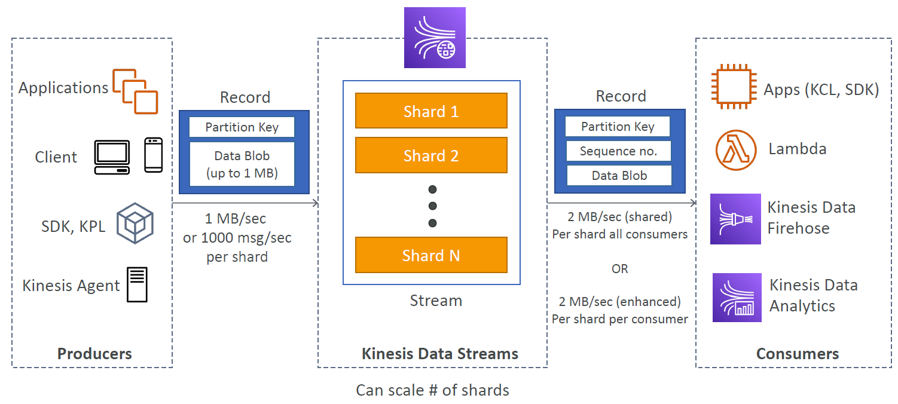
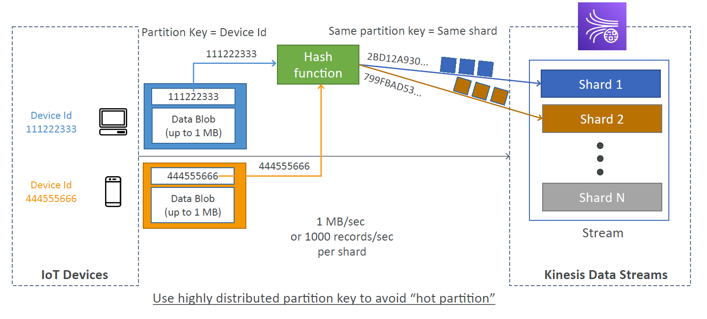
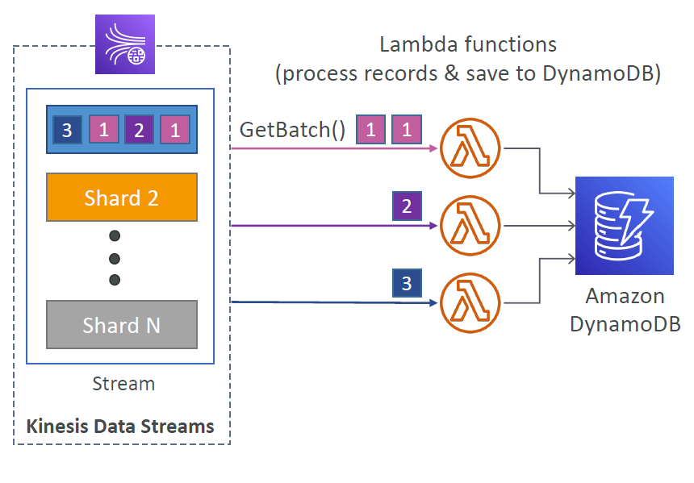
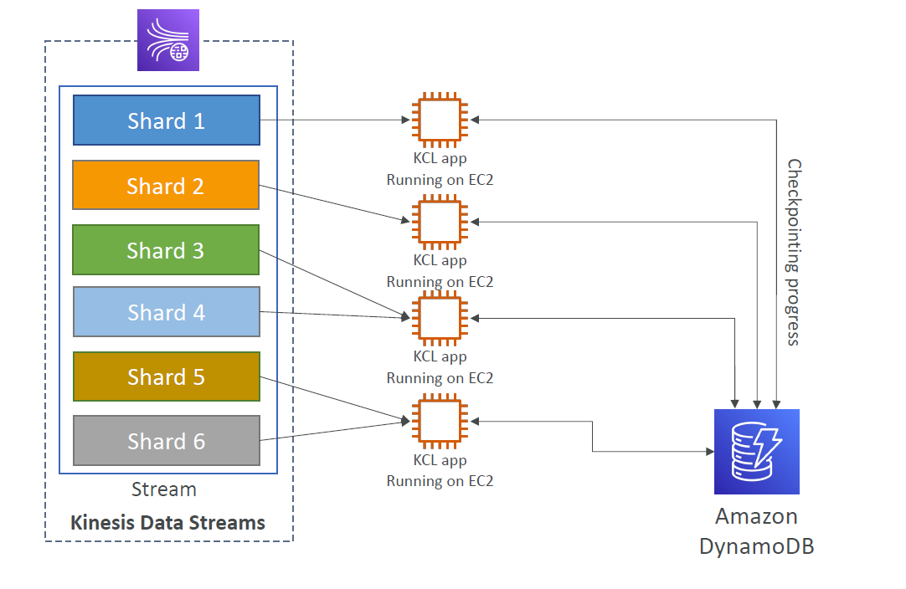

# Kineses Data Streams

Stream creation service. 

Noting:
- consumers listen to shards
- partion keys assign what shard a producers data goes to
- data in streams can be replayed based on retention period (1 day (default) to 365 days)

## Producers

a device that produces data for kinesis via the kinesis SDK.

## Consumers

An AWS service that listens to data on the stream.

Two methods of consumption
- Shared fan out consumer (2MB/s for all consumers)
- Enhanced fan out consumer (2MB/s per consumer)

## Scaling Data Streams

### Shard Splitting

Split a shard into two new shards. Old shard is removed. Bandwidth is updated to suit.

a shard that is recieving alot of traffic is called a "hot shard".

### Shard Merging

Combine two existing shards into a new shard. Existing shards are removed. Bandwidth is updated to suit.

## Provisioned Throughput Exceeded

When you are producing more data than you have provisioned in your data stream shards.

You can correct this error by performing the following:
- Exponential backoff
- Shard scaling
- highly distributed partition key

## Kinesis Client Library (KCL)

Library that allows you to read from kinesis data streams. 1 shard per KCL instance.

