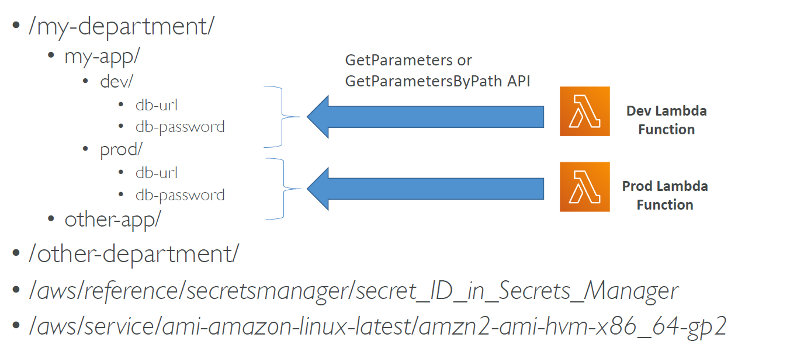

# Systems Manager (SSM) Parameter Store

Serverless service to store all your application parameters securely. These parameters can be anything e.g. user names and passwords.

The structure in which these parameters are stored is defined by the following image:

</img>

## Encryption

Values are encrypted and encryption is managed by KMS.

## Parameter Policies

Policies can be assigned to parameters to enforce the following:

- TTLs (expiration)
- Notifications (alerts when keys havent been changed for x days)
- etc.
