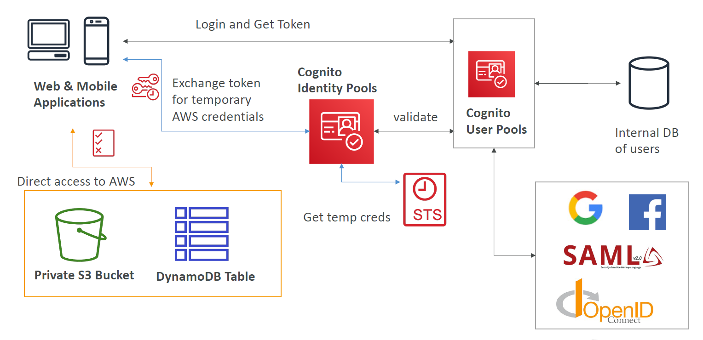

# Cognito

Service for managing user authentication.

## Cognito User Pools (CUP)

Serverless database of users for your web applications. Returns a JSON Web Token (JWT) with authentication credentials when users login. 

CUP is also an identity provider.

Supports:
- Authentication of users via:
    - username, password, MFA
    - Facebook, Google etc.
- verification of emails and phone numbers

## Cognito Identity Pools (CIP)

Identity pools give users access to **AWS services** by exchanging their token for AWS credentials.

User pools stores all the users and passwords.

</img>

## Cognito Sync

Stores preferences, configuration and state of application. Superceded by AppSync.

## Hosted Authentication UI

Customisable authentication UI that you can add to your apps to handle the sign-up and sign-in workflows.
