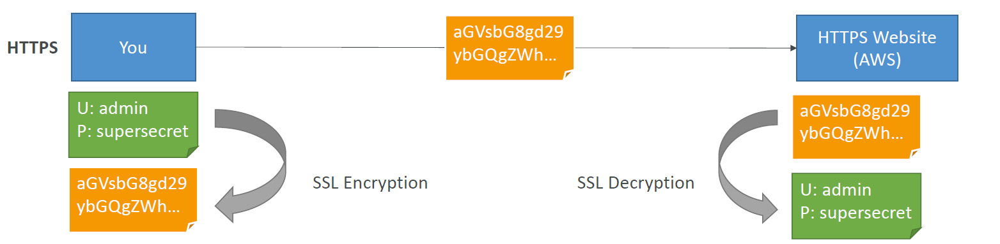
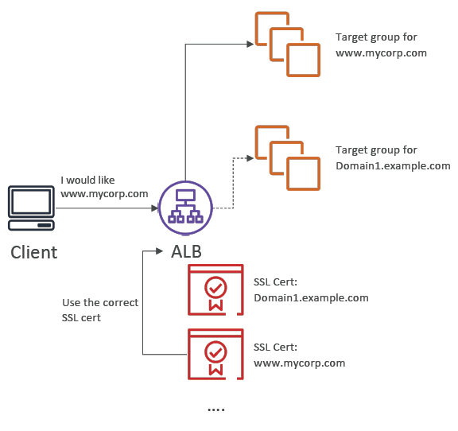
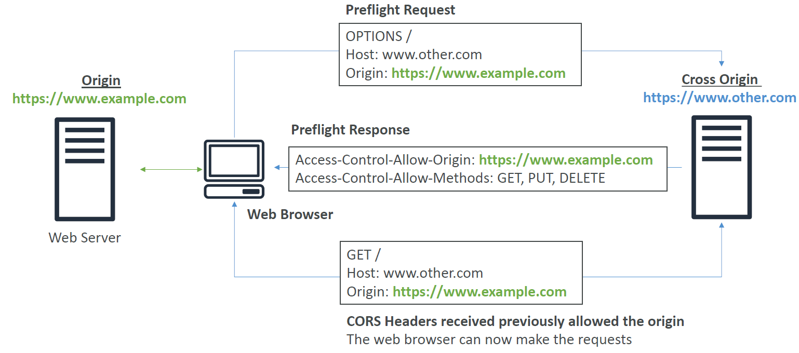

# Security

All AWS services related to security

## Shared Responsibility Model

Security is subject to this model. **Important** to understand the basics of this as will come up as a few questions in the exam.

AWS         - security **of** the cloud
Customer    - security **in** the cloud

# General Security Theory

## Security Groups

Controls how traffic is allowed into and out of EC2 instances. i.e. Firewall.

Key ports

21 - FTP (File Transfer protocol) - upload files
22 - SSH (Secure Shell) - Connect to Linux, mac, windows (>v10)
22 - SFTP (secure file transfer protocal) - upload files with SSH
80 - HTTP
443 - HTTPS
3389 - RDP (Remote desktop Protocol) - Log into windows instance

- PostgreSQL: 5432
- MySQL: 3306
- Oracle RDS: 1521
- MSSQL Server: 1433
- MariaDB: 3306 (same as MySQL)
- Aurora: 5432 (if PostgreSQL compatible) or 3306 (if MySQL compatible)

*Note: General rule of thumb is if you are getting timeout (endless loading screens) on your websites, it is likely a security group issue.*

Default configuratin
- all inbound traffic blocked.
- all outbound traffic is authorised.

## Encryption

Scrambles data to make it unreadable without a secret key being provided.

For encryption to operate you need a private key and encryption algorithm.

All keys are managed in a service which can be KMS or otherwise.

### In-flight

Anytime data is encrypted whilst moving. Encrypted client side and decrypted server side.

Protects from MITM (man in the middle) attacks. e.g. no one can see my credit card details when i send them to a website with in-flight encryption.

The most common example is HTTPS communications with the Secure Socket Layer (SSL) / Transport Layer Security (TLS) encryption protocols.

Notes: 
- TLS = newer version of SSL
- ELB uses X.509 encryption

### At-rest

Anytime stored data is encrypted.

## Processes

Encryption can be performed in the following two ways.
- Server Side Encryption (SSE), or;
- Client Side Encryption (CSE)

### SSE-KMS

Key Management Service (KMS) handles all encryption operations.

- *HTTP header "x-amz-server-side-encryption": "aws:kms"*
- *CMK (Customer Master Key)*

### SSE-C

Private keys managed client side and AWS performs encryption with key.

- *Specify HTTP**S** header for encryption and private key.*

## Certificates

Is a document used to prove the ownership of a public key.

Certificates are created and managed by the Amazon Certificate Manager (ACM) service.

## Server Name Indication (SNI)

Loads multiple SSL certificates on one server. Enables single server to host multiple websites.

# Cross Origin Resource Sharing (CORS)

Web browser based security mechanism to allow requests from one origin to another ONLY if the other origin allows it.

Origin = A scheme (protocol), a host (domain) and a port. i.e. the following aspects of a URI.

*https*://**www.domain.com**:*port*

The process can be described by the following diagram.

Note:
- The HTTP header "Access-Control-Allow-Origin": "allow origin domain name" will be returned as a response if the **other** origin allows resource sharing from the source origin.

# Pre-signed URLs

A url with the authentication included. **Only allows access to one file or location**.

Can only be generated by using the AWS CLI or SDK only.

Use cases
- only allow access to premium content from signed in users
- allow users to upload files to buckets (e.g. profile photo)

Configured by specification of the:
- expiration
- trusted signers
- ip ranges

# Cookies

A cookie is a piece of data stored in the client/user brower.

Cookies can be used to store entire application state.

Session is simply a cookie with a session id attached. This lets the server manage whether this id is authenticated or not and store application state on the server.

Another method of authentication management for resources. Except the cookie can be used for accessing multi files or resources.

# Internet Protocol Security (IPSec)

IPsec is a group of protocols that are used together to set up encrypted connections between devices.

Specifically IPsec operates at layer 3 of the OSI model (the network layer).