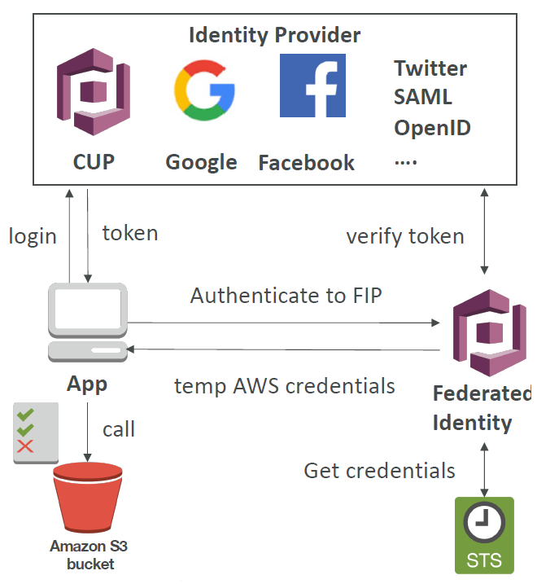
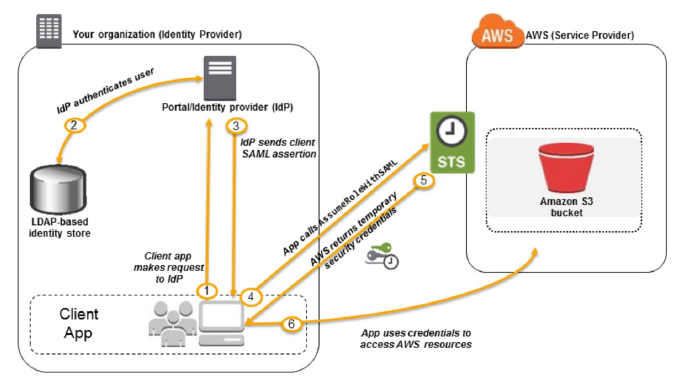
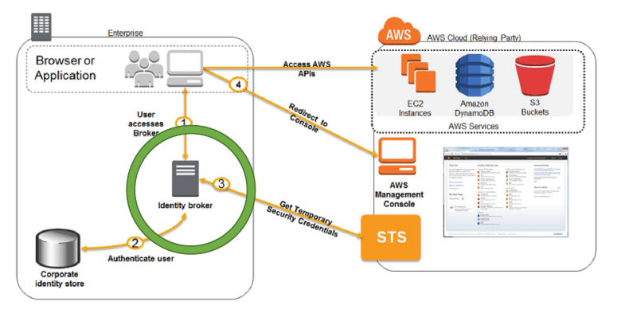

# Security Token Service (STS)

Generates temporary access tokens.

Token valid for up to 1hr.

## Assume Role

STS can be used to give a user temporary access to assume a "Role". i.e. you might have a role in IAM that allows access to an s3 bucket.

You can use STS to give a user a temporary token to use that role.

Three key API functions to perform this:
- AssumeRole
- AssumeRoleWithSAML
- AssumeRoleWithWebIdentity

## Federated Identity

Provide users OUTSIDE your AWS account direct access to AWS Resources.

i.e. when you want to mangage the authentication of your users outside of AWS.

### Security Assertion Markup Language (SAML) 2.0

SAML is a standardised language that Identity Providers (IdPs) use to pass around security credentials.

SAML is one process that can be used to manage authentication outside of AWS.

### Custom Identity Broker Application

If SAML 2.0 is not supported by your idP then you can write a custom "middle man" (broker) application that communicates with the 3rd party idP and STS to authenticate your users.

### Web Identitiy Federation

Again hand over authentication to 3rd party. Except this time using web identity.