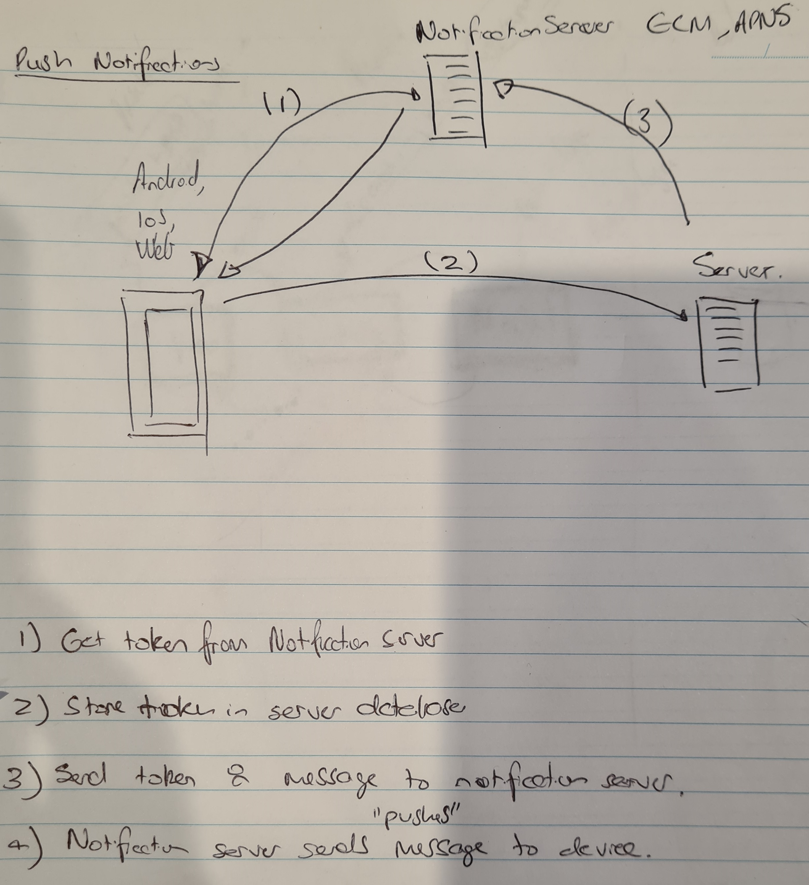

# Firebase Cloud Messaging

Serverless push notification service.

## Push Notifications

A way to send a message to your users even when your application is closed. Used to get your users back into your app.

Best explained by the following diagram:

</img>