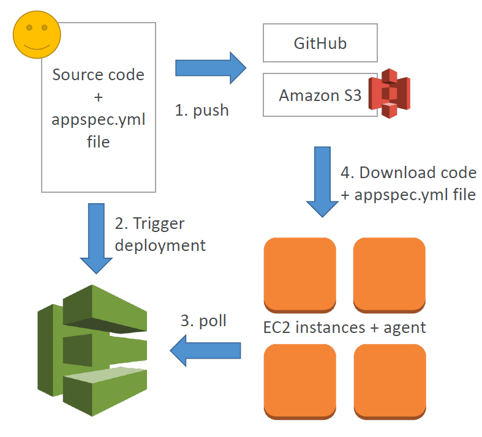
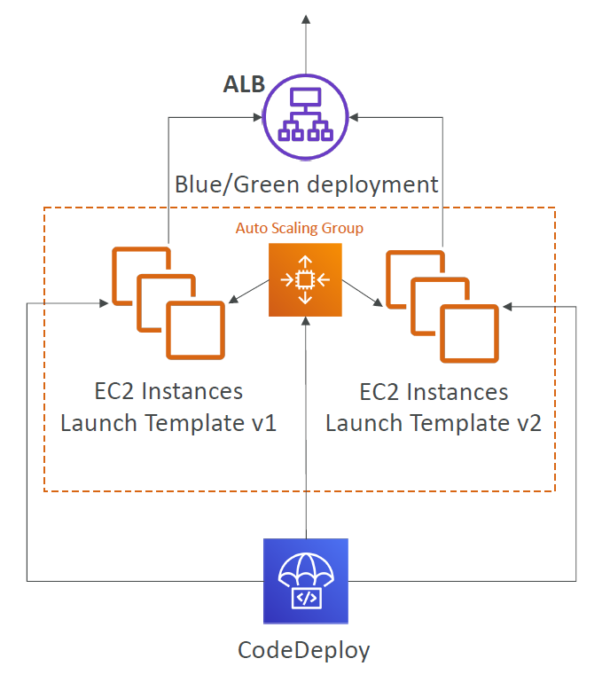

# CodeDeploy

Service to deploy your applications on **manually** managed EC2 instances.

Operation is described by the following diagram:



Notes:
- Similar to Ansible and Terraform.
- EC2 machines must be running CodeDeploy agent.

## Deploy Configuration

Specified in the following file:
```
./appspec.yml
```
File is structured as follows:

- File section (where to source deployment application files)
- Hooks (set of instructions)
    - Application stop
    - Download bundle
    - BeforeInstall
    - AfterInstall
    - Application Start
    - Validate Service

```
A hook is place in code that allows you to tap in to either provide different behavior or to react when something happens.
```

Notes:
- The .yml file can refer to separate script files. These script files can be bash scripts.

## Deployment Options

### In Place (Half At a Time)

In place is very similar to how a rolling update works on Elastic Beanstalk

### Blue / Green

Operate as per the following diagram



Note:
- you can specify a time that the blue deployment lasts for until it is removed.

## Grouping

EC2 instances or ASGs can be grouped into "deployment groups" e.g. dev, test, prod, etc. using tags.

YOu can then target specific groups in your deployments.

## Roll Backs

Automated rollbacks can be configured as follows:

- Failed deployments
- Alarm thresholds

CodeDeploy will redeploy the last good known version.