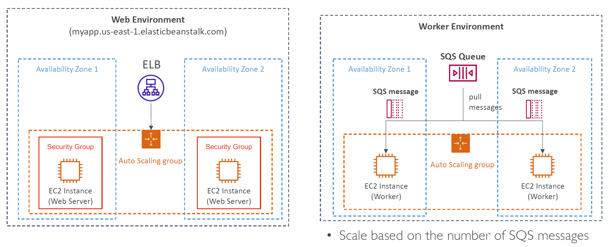
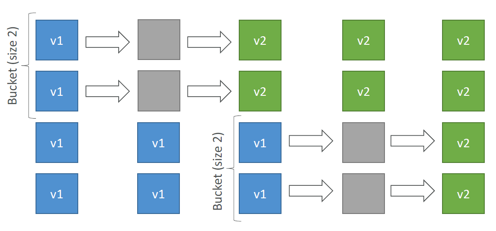
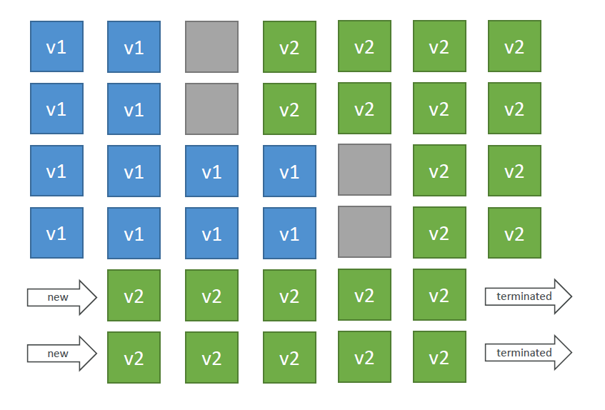
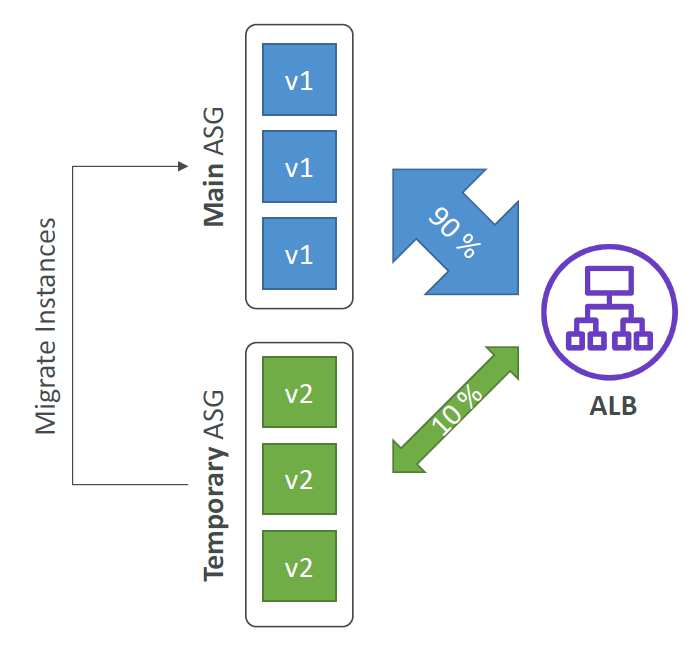
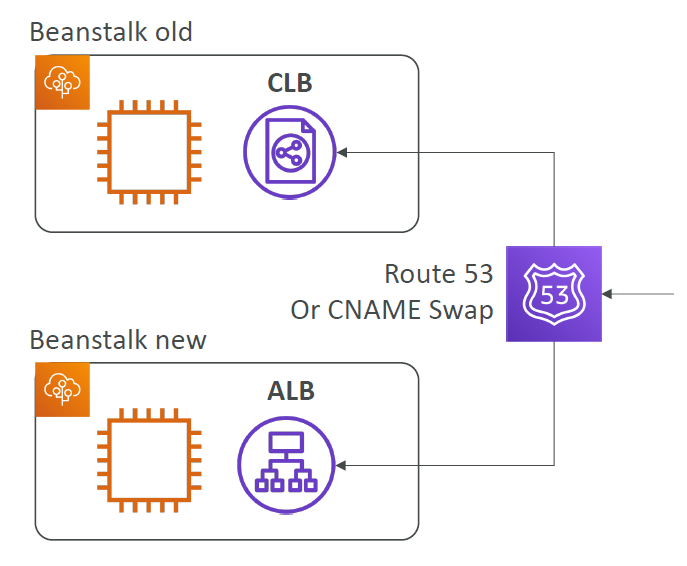

# Elastic Beanstalk

Managed service for deploying a **full application stacks** on AWS.

Therefore the developer only needs to be concerned with the Application code.

Can deploy *pretty much* anything.

## Engine

Elastic Beanstalk uses CloudFormation under the hood.

## Components

The following items/components make up an elastic beanstalk deployment.

- Application
    - collection of Elastic Beanstalk components (environment, app versions etc.)
- Environment 
    - collection of AWS resources running app
    - two tiers (architectures)
        - web server tier
        - work environment tier

Note:
- supports multiple environments (dev, prod, test etc.)

## Tier Architecture

Beanstalk environments make use of two distinct architectural patterns. As follows:



## Infrastructure 

You retain full control over the AWS resources powering your application and can access the underlying resources at any time.

## Custom Platforms

Allow you to create your own platform to run on Elastic Beanstalk if you are using a language that is unsupported by beanstalk or you dont want to use docker containers.

## Deployment Modes

### All At Once

Deploy everything in one go. Fast, but comes with some instance downtime.

### Rolling

update a few instances at a time, then move to the next instances to update.



### Rolling with Additional Batches

Similiar to rolling new additional instances add added to the ASG to aid in the deployment.



### Immutable

Spins up new ASG and EC2 instances to deploy the app, deploys new app version, then swaps over to the version when everything is healthy.

### Blue / Green Deployments

Manually implemented feature. Where you...
1. Create a new "stage" environment
2. Deploy new green version (v2) here
3. Configure Route 53 weighted routing policy
4. Validate green environment
5. swap url permanently over to green
6. shut down blue environment


### Canary Testing / Traffic Spliting

Same process as blue green deployment however it is automated and uses an ALB to redirect traffic.



## Lifecycle Policys

Specify rules for how your application version will be handled for example retain at most 180 days of version or 200 versions. 

Note:
- Beanstalk supports at most 1000 application versions.

## EB Extensions

Configuration of additional services which can be attached to your beanstalk deployments. For example RDS, Elasticache, DynamoDB etc.

Create the following in your app directory to do this...
```
.ebextensions/
    rds.config
    elasticache.config
    environment-varaibles.config
    etc...
```

## Cloning

Clone a copy of an existing environment.

Usesful for creating a test environment for your new application version.

## Docker

Beanstalk has docker support in two modes.
- Single - Runs a single container on a single EC2 for you.
- Multi - Runs multiple containers on ECS for you.

## Migration

### Load Balancer 

Given you cannot change the Load Balancer type after you have created a elastic beanstalk envirnoment. To change it you need to perform a migration. This migration process can be described by the following diagram:



## Instantiating Applications Quickly

EC2
- Golden AMI - completely pre configured AMI for a ASG
- Bootstrapping with user data

RDS
- restore from snapshot

EBS
- restore from a snapshot