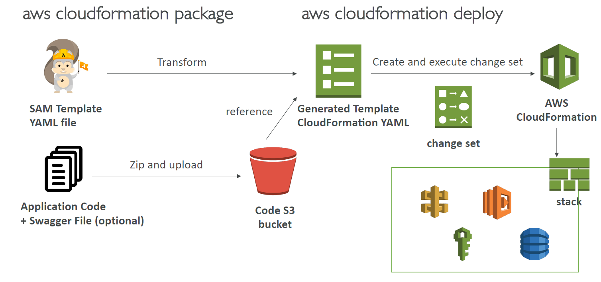

# Serverless Application Model (SAM)

Infrastructure as Code (IAC) for serverless applications.

SAM templates are essentially cloudformation templates, but they allow you to define your serverless app with more brevity. SAM is compiled to cloudformation code then deployed to AWS. See [here](https://stackoverflow.com/questions/50140885/difference-between-sam-template-and-cloudformation-template) for cloud formation vs sam.

## Process

- **create**: SAM .yaml file
- **package**: execute *cloudformation package* in cli to compile sam file
- **deploy**:  execute *cloudformation deploy* to deploy compiled file

The following header indicates a SAM document

```yaml
Transform: 'AWS::Serverless-2016-10-31'
```

</img>

