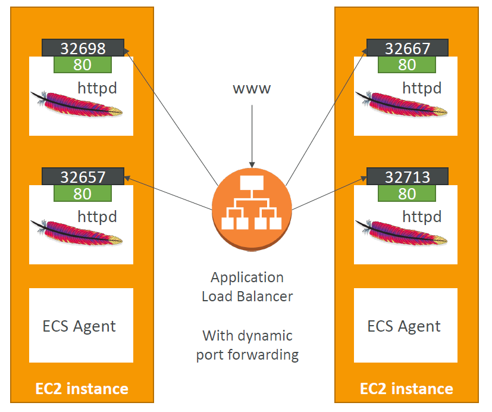
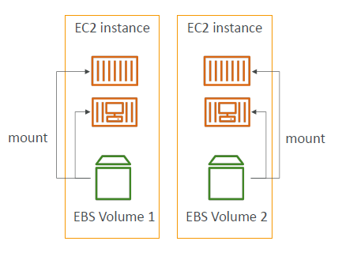
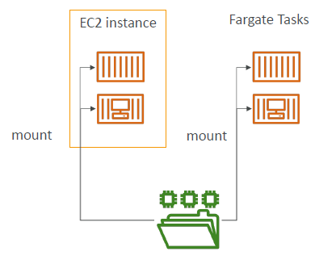

# Elastic Container Service (ECS)

Service that manages **Docker** containers on AWS.

Launches containers across a cluster of EC2 instances. Where the overall structure is presented by 5 key components as follows:

## Architecture

- ECS
    - ECS Service
        - ECS Task
            - Container 1
            - Container 2
            - ...
    - Cluster
        - VM 1
            - Docker agent
            - Container 1
            - Container 2
            - ...
        - VM 2
            - ...
        - ...

## Definitions

## ECS Task

JSON definition which tells ECS what docker image to run and how to run it.

Some definition options include 
- image
- port bindings (container and host)
- RAM and CPU required
- environment variables
- etc.

Very similar to how you would specify configuration options for a EC2 instance (VM).

## ECS Service

Defines what tasks to run, how many should be run and how they interact.

## ECS Agent

An agent always communicates with an agency. In this context it is an ECS Agent is a docker container installed on each EC2 instance that allows it to communicate with ECS.

# Cluster Mangement

A Cluster is simply an array or farm of VMs.

ECS supports two forms of cluster management.
- Classic, and;
- Fargate.

## Fargate (Automated)

Fargate is serverless technology to automatically manages the infrastructure (EC2 instances) for you. 

It is the newer and far more simple way to manage your ECS containers.

## Classic (Manual)

Manually manage EC2 clusters.

When you create an ECS cluster in this way an ASG is created to manage the cluster. This uses a ASG template with a standardised AMI to communciate with ECS.

### ECS Networking

ENIs are bound to each underlying EC2 instances. Which allows each task to have its own private IP in the form or IP:port.

### Scaling

To scale ECS tasks you need to be able to route Task traffic to to different instances of these tasks. This is done by configuring an ALB with dynamic port forwarding as per the following diagram.

Note: 
- You can specify the ALB on service creation.
- Dynamic port forwarding is configured by leaving the host port mapping definition empty in the Task definition.

### ECS Service Task Placement

Define where you want new tasks to be placed and where you want existing tasks to be removed.

#### Task Placement Process

The following steps are executed by ECS to place a task:

1. Check what instance the task **can** be placed in by looking at RAM, CPU and port availability
2. Check task placement constraints
3. Check task placement strategy

### Task Placement Strategies

3 configuration options supported:

- Binpack: place tasks based on the minimum available amount of CPU or memory. i.e. minimises the running instances and saves costs.
- Random: place task randomly
- Spread: place task based on the specified value. Specified values could be availability zone for example.

Can be mixed and matched.

### Task Placement Constraint

2 constraints supported:

- distinctInstance - place task on a unique instance
- memberOf - place task on an instance that meets certain criteria

### ECS Service Auto Scaling

Configuration options to automatically scale **tasks** in a service. Does not scale the underlying infrastructure.

Same auto scaling options as ASGs. e.g. simple, step and metric scaling.

ECS Service Auto Scaling != ASG Auto Scaling

#### Cluster Capacity Provider

Assigned to an ECS Service to allow the service to also scale the underlying infrastructure.

## ECS Data Values

Data volumes can be attached to tasks in the following manner.

EC2 + EBS Volumes

EC2 + EFS NFS

Bind Mounts - ephemeral storage

# General Configuration

## Rolling updates

Specify a minimum and maximum percentages for updating the versions of your ECS Tasks.

## IAM Roles

IAM Roles can be assigned as follows:
- ECS Tasks
- ECS Services
- EC2 instances - An Instance role is assigned to allow the ecs agent to operate correctly