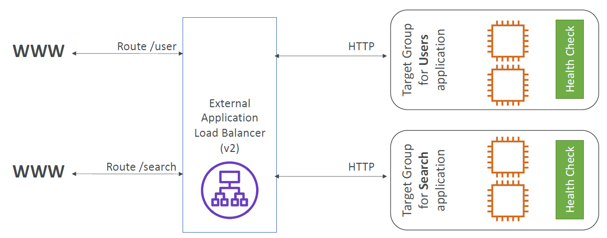

# Application Load Balancer (ALB)

Load balancer that performs balancing at the Application level (i.e. HTTP || HTTPS) in the network data packet.

Supports:
- HTTP, HTTPS and WebSockets
- Routing traffic based on
    - URI. Including routes eg. /users, host names and query strings
- Routing to individual containers on the same EC2 instance
- Supports lambda functions
- Forwards client IP to downstream servers as X-forwarded-For header

## Architecture

