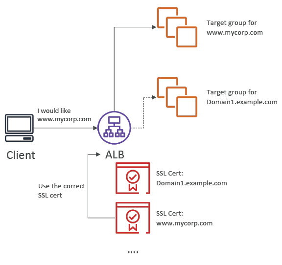

# Encryption

Encryption is provided with the Secure Socket Layer (SSL) / Transport Layer Security (TLS) encryption protocols.

These encrypt "in-flight" traffic. Which is decrypted on server and client ends.

Notes: 
- TLS = newer version of SSL
- ELB uses X.509 encryption

## Certificates

Certificates are created and managed by the Amazon Certificate Manager (ACM) service.

## Server Name Indication (SNI)

Loads multiple SSL certificates on one server. Enables single server to host multiple websites.

