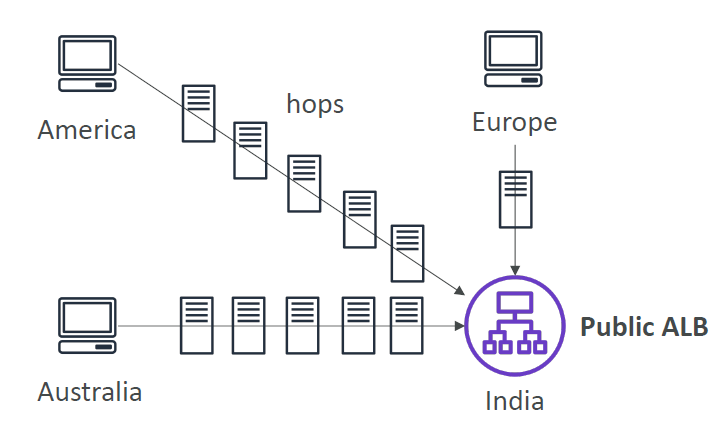

# AWS Global Accelerator

Uses the **internal** (private) AWS network to route HTTP traffic. As opposed to the public internet.

This results in improved application latency.

Good for gaming, IoT (MQTT) etc.

Supports:
- fast regional failover

## Public Internet Routing

Standard routing of traffic over the internet can be thought of as follows:

hops = routers -> introduce latency... not an optimal way of sending the traffic.

## Global Accelerator Routing

unicast ip = one server holds one ip address
anycast ip = all servers hold same ip address but client routed to closest one

**Global accelerator uses anycast ip**

i.e. anycast ip is a public ip of your application server and can be assigned to the DNS.

## Use Cases

### Blue/Green Deployment

Great for blue/green deployment has you are not subject to the TTL on DNS servers and can dynamically redirect traffic as needed to different endpoint groups.

Global accelerator supports:
- endpoint weights to determine the proportion of traffic that is directed to endpoints in an endpoint group, and
- traffic dials to control the percentage of traffic that is directed to an endpoint group.