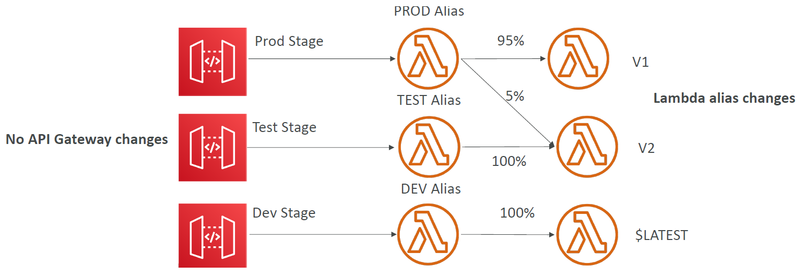

# API Gateway

Serverless API service. Create and manage web APIs.

Supports APIs of type:
- REST
- HTTP
- Websockets

APIs can pass requests to 
- Any AWS service via its API
- Any custom HTTP endpoints

General features:
- authentication
- request throttling
- swagger support 
- openAPI (industry standard for REST API design) support
- caching

## Stages And Stage Variables

API gateway configuration is created. Then this configuration is deployed to a stage.
```
https://www.some_domain.com/stage/base_api_configuration
```
These stages can pass stage variables to the underlying configuration to customise it. For example sending a resource to differing lambda aliases.

</img>

## API Endpoint Types

- Edge Optimised via CloudFront
- Regional
- Private - accessed via VPC

## Authenication

### Sigv4 (IAM)

Authenicate users with IAM to give IAM users access to API gateways.

## 3rd Party Authoriser (Lambda Authoriser)

Use any 3rd party identity provider to authorise use then verify this in AWS with Lambda authoriser.

i.e. pass user token to REST API aquired from 3rd party authentication service.

## Cognito User Pools (CUP)

See Cognito overview for details.