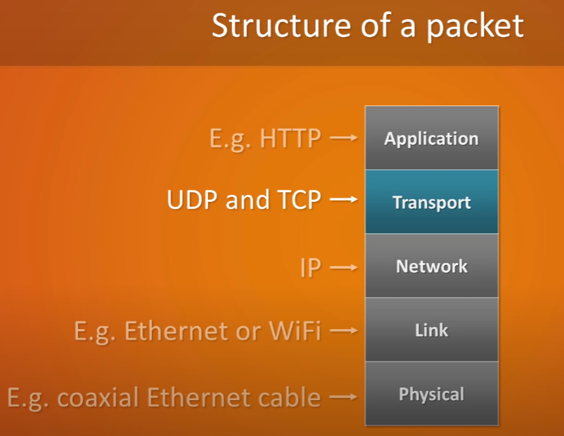

# Network Load Balancer (NLB)

Load balancer at the Transport layer (TCP/UDP) of the network data packet.

Supports:
- TCP, TLS (secure TCP) and UDP
- extremely high performance
- supports static IP (Elastic IP)

## Network Data Packet

Described by the Open Systems Interconnection (OSI) model as follows:

seven layers that computer systems use to communicate over a network as shown in the following diagram.

More simply explained by the 5 layers below:

## Transport Layer Protocols

Protocols that are used at the Transport layer of a network packet. 

The purpose of the transport layer is to allow multiple applications to use the same network connection simultaneously. 

Effectively they are incharge of assigning and reading the ports on send and recieve of a packet respectively.

### Transmission Control Protocol (TCP)

- heavy weight (larger packet sizes) but more reliable
- stream orientated

### User Datagram Protocol (UDP)

- light weight (smallet packet sizes) but less reliable
- message orientated