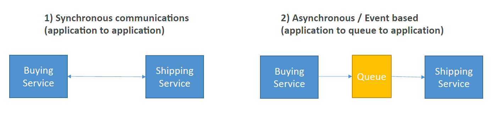

# Messaging

Services that allow multiple applications to communicate with one another.

Two patterns
- synchronous communications
- asynchronous communications

- SQS - Que Model
- SNS - Pub/sub model
- Kinesis - real time streaming model

## Message Types

- SMS
- Email
- Email-JSON
- HTTP
- HTTPS

