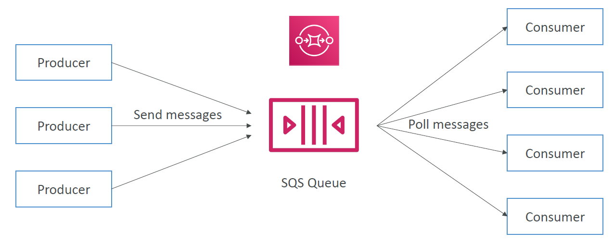

# Simple Queing Service (SQS)

Messaging service which stores mesages in a que. Used to decouple applications.

Follows the que architectural pattern, as shown below:

Definitions:
- producer: send messages
- que: store messages
- consumer: process messages by polling, processing and deleting

Notes:
- short lived (messages last 4-14 days)
- low latency
- can have duplicate messages (therefore require idempotent consumers)

Asynchronous Request Response Pattern can be implemeted using SQS request and response ques. AWS provides the **SQS Temporary Que** functionality to achieve this.

## Producing Messages

Use the SendMessage API from the SQS SDK to send messages to SQS up to 256kB in size.

## Consuming Messages

Consume messges using the SQS SDK.

## Message Timer

Set the visibility of a **individual** message. Message timers can be set when recieved and when polled.

## Message Visibility Timeout

After a message is polled it becomes invisible for a timeout duration. When timeout is complete the message becomes visible again for other consumers.

ChangeMessageVisibility API can be used to change the visibility duration.

## Dead Letter Ques

Set a threshold to put message into a cannot be processed (dead letter) que to avoid infinite message processing loops.

Useful for debugging.

## Delay Que

Postpone the delivery of **all** new messages for a specified duration before they are seen by consumers.

Delayed messages are placed in the SQS delay que.

## Que Types

### Standard

Messages not guaranteed to be in order. Unlimited throughput.

### First In First Out (FIFO)

SQS can be configured to be a FIFO model meaning messages will be output in the same order that they are recieved.

Usually only supports on consumer. However, **can have group ids assigned to messages to allow multiple consumers.**

**The name of a FIFO queue must end with the .fifo suffix.**

By default, FIFO queues support up to 3,000 messages per second with batching, or up to 300 messages per second (300 send, receive, or delete operations per second) without batching.

SQS Ques cannot be converted between types. They must be deleted first.

#### Deduplication

Prevent message duplication. 

Two methods.
- Content based - message body gets automatically hashed with the SHA-256 algorithm. SQS checks for duplicate hashes
- Id based - specify a deduplication ID on the message

#### Message Grouping

A MessageGroupID parameter must be specified for all messages in a FIFO que. Messages with the same group id can only have **one** consumer.

## Polling

Two options
- short polling - a response is returned right away, even if the query found no messages.
- long polling - Long polling "waits" to return a response until a message arrives in the message queue or the long poll times out.

Long polling is almost always preferable to short polling.

## Que Access Policy

Resource access policy. Two use cases.

- Cross account access
- Publishing events from S3 buckets to SQS ques

## SQS Extended Client

Java library that enables messages larger than 256 kB to be sent to SQS. Uses an Amazon S3 bucket as the repository for the message data.

## Use Cases

### Decoupling Applications

