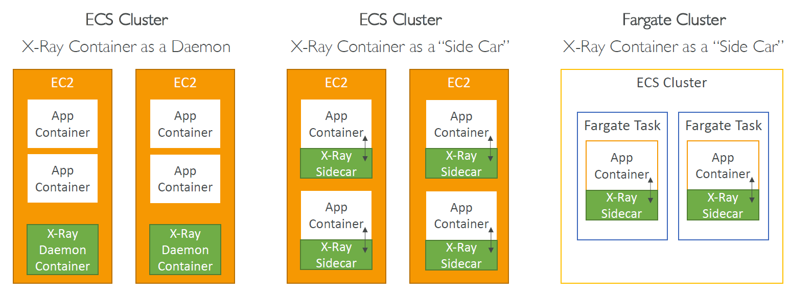

# X-Ray

Instrumentation service for your microservices based application. Does this by tracing the network communications and providing visual representations of tracing results. 

Best shown by the diagram below:

Shows key information at each trace point such as:
- average response time 
- requests per minute
- Ok and erro rsummary

## Tracing

### Segments

Segment is assigned on a per application basis. i.e. each express.js microservice produces its tracing results into a segment.

### Subsegments

Additional information in each of your segments.

### Trace

Collection of segments to form and end-to end trace.

### Sampling

Control the amount of requests sent to X-ray. Cthis is done by specifing a reservoir and a rate.

Default sampling rules are:
- 1st request / second (reservoir)
- 5% of requests thereafter (rate).

Notes:
- Sampling rules are stored in the aws cloud
- Can be used to reduce x-ray costs

## Enable X-Ray

- import X-RAY SDK into code.
- Install X-RAY daemon || Or enable X-RAY AWS Integration

## ECS and X-Ray

