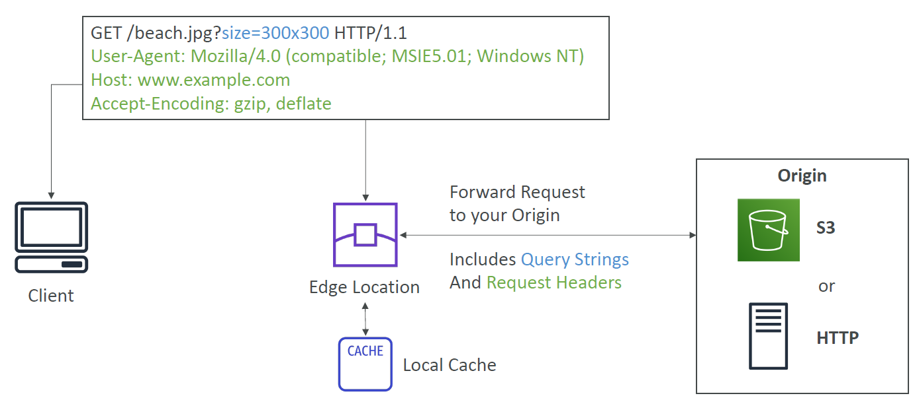

# Cloud Front

a Content Delivery Network (CDN).

Works by caching content at edge locations / points of presence around the world.

Great for static content hosting.

Static content is peristed for the TTL specified.

## Architecture

Cloud front CDN basic operation can be described by the folloiwng diagram.

## Origins

Cloud front can have the following origins (http resources)

- S3 bucket
- Custom HTTP Origin
    - ALB
    - EC2 instance
    - S3 website
    - Any http backend you want

*Note: Security groups of origins must allow edge location ips or be public.*

### Multi-Origin

Specify origins based on the URL path.

/image/*
/api/*
etc.

### High Availability

Can be placed in origin groups and have a primary and failover origin specified.

For example you can have a s3 bucket in region A. Replicated it to region B. Then placed both of these in an origin group. Then cloudfront will use the primary, then the failover if the primary fails.

## Security

### General

- DDoS (Direct Denial of Service) protection
- integration with AWS shield
- AWS Web application firewall

### Origin Access Identity

Can configure the IAM policies for origins in cloud front by specificiation of Origin Access Identities.

e.g. Specify that a origin (s3 bucket etc.) can only be accessed by cloud front.

### Geo Restriction

Geographic areas can be restricted from accessing the CDN by configuring:
- White lists
- Black lists

common use case is to adhere to copyright laws.

### Field Level Encryption

HTTP headers / fields can be encrypted by edge locations on top of in-flight encryption.

e.g. add additional encryption to user credit card information to prevent it been leaked in internal VPC.

## Pricing

- pricing differs for edge locations
- more data in cloud front = less cost/gb

### Price Classes

- All
- 200 - all regions except most expensive
- 100 - only cheapest locations