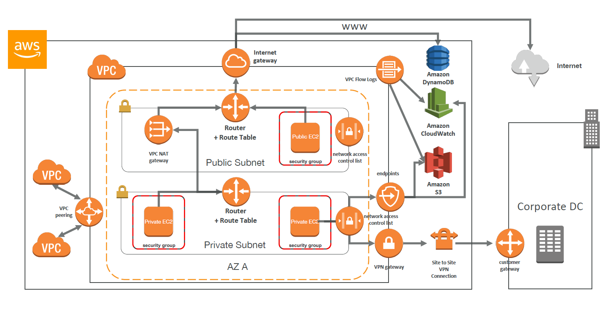
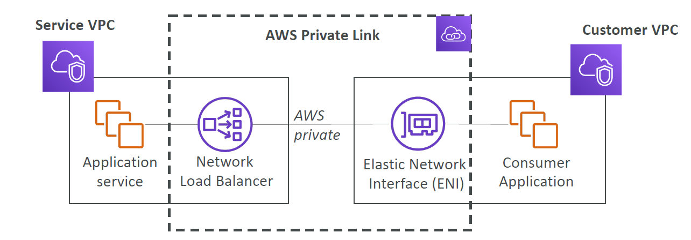
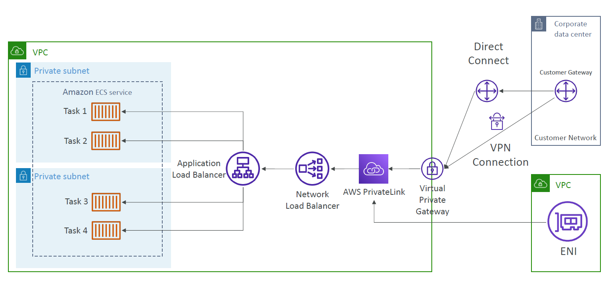
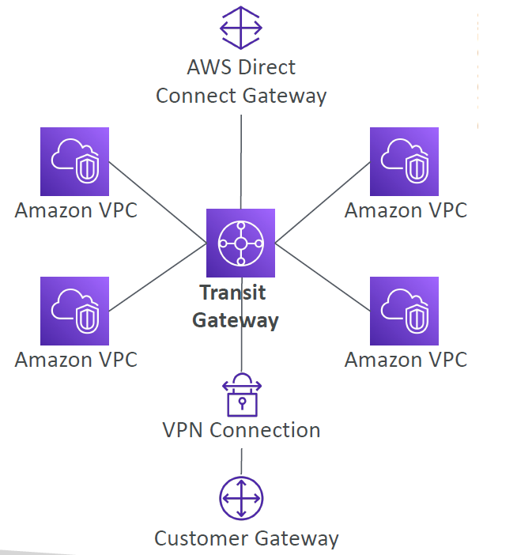

# Virtual Private Cloud (VPC)

Own network in the cloud. 

All important aspects of a VPC can be explained entirely by the diagram below.

5 VPCs per region
 5 CIPRs per VPC
    /28 to /16 allowed

## Subnet

Network within a network.

Can be either: public or private.

*Important Note:* **Common Exam Question** 
AWS reserves 5 IPs in each subnet:
- last 1
- first 4

10.0.0.0: Network address
10.0.0.1: AWS VPC router
10.0.0.2: AWS mapping to Amazon DNS
10.0.0.3: future use
10.0.0.255: Network broadcast address

## Classless Inter-Domain Routing (CIDR)

All possibilities of an IP address is provided as follows:

(0-255).(0-255).(0-255).(0-255) = 2^32

A CIDR is represented as follows:

**0.0.0.0**/*0*
**0.0.0.0** = base IP
*0* = subnet mask = how many bits can change in the IP.

Subnet mask can also come in more explicit forms e.g. 255.255.255.0

Allowable IP ranges can be determined from a subnet mask as follows:

IPs = 2^[32-subnet mask]

/32 = 2^(32-32 = 0) = 1 IP
/31 = 2^(32-31 = 1) = 2 IP
/30 = 2^(32-30 = 2) = 4 IP
...
/0 = 2^32 = all IPs

## Private vs. Public IP

Internet Assigned Numbers Authority (IANA) established certain ranges of IPs that should be for private (LAN) and public (WAN) addresses.

10.0.0.0 - 10.255.255.255 (10.0.0.0/8) - big network default
172.16.0.0 - 172.31.255.255 (172.16.0.0/12) - AWS VPC default
192.168.0.0 - 192.168.255.255 (192.168.0.0/16) - Home network default

Rest are public IPs

## Internet Gateway

Gateway is just a router and also NAT device specifically used to connects VPCs to internet.

*Important: 1 internet gateway per VPC*

### Egress Only Internet Gateway

Egress = outgoing only.

Only used for IPv6 connections

## Route Table

Specifies where network traffic is routed to and from within a network.

i.e. a route table can be thought of as a physcial router.

An example route table is as follows:

10.0.0.0/16 -> local -> communicate within private network
0.0.0.0/0 -> internet gateway -> send all public traffic through the internet gateway

## Network Address Translation (NAT)

A way to map multiple private IP addresses to a Public one. Allows connecting one network to another under a *SINGLE* IP address.

### NAT Instances

An EC2 instance that manages the NAT process.

- Supports port forwarding.
- Can be used as a bastion server.

### NAT Gateway

AWS managed NAT. 

Which has high availability and scalability.

- Does NOT support port forwarding.
- Can NOT be used as a bastion server.

## DNS Integration

Two important settings to integrate your subnets with the Amazon DNS (i.e. Route 53).

enableDnsSupport: Decides if DNS resolution is supported and will query the AWS DNS server if true.
enableDnsHostname: Assigns public (auto-generated) hostnames to EC2 instance.

## Network Access Control List (ACL)

Network level firewall security. i.e. ACL sits at the subnet router.

Security Group vs. ACL

Security Group is stateful - return traffic auto allowed
ACL is statelss - return traffic is always assessed

VPCs support both ACLs and security groups.

## Emphemeral Ports

Temporary ports used by the transport layer in a network request.

# VPC Peering

Connect two VPCs **privately** within the AWS cloud.

VPC peering is **not** transitive. i.e. does not apply between subsequent members. e.g. you need to explixity connect each VPC.

## VPC Endpoints

Another "router" which communicates between our subnets and the AWS managed services directly.

Adds route table rules to communciate with services such as S3 etc.

### Types

- Interface (i.e. ENI)
- Gateway (i.e. an instance) - S3 and DynamoDB require this.

## Flow Logs

data about your ip traffic.

- VPC
- Subnet
- ENI

## Bastion Host

Any computer used to allow access from a public network to a private network. Also...

"A bastion host is a special-purpose computer on a network specifically designed and configured to withstand attacks." 

Sits in the public subnet and connects to private subnet via the NAT gateway or instance.

## Site to Site VPN

Connect a network outside of AWS to your AWS VPC to make it seem like they are part of the same network.

## AWS Private Link

Expose a VPC service to multiple VPCs privately within the AWS network.

operation can be explaiend as follows:

## Direct Connect (DX)

AWS Direct connect are physical locations to give a direct private connection between your remote data center and the AWS cloud as opposed to going through the internet.

~ 1 month to setup.

## Connecting Corporate Data Centers to AWS Cloud

Options for connecting to the cloud can be described below.

## VPN Cloud Hub

like VPN Gateway. However allows connecting multiple external on premise networks to a VPC.

## Transit Gateway

**Transitive** gateway to connect to a VPC.

## Equal Cost Multi Path (ECMP) Routing 

allows multiple connections between a transit gateway (i.e. router) and external network to increase the bandwidth.

# Cost

Egress (outgoing only) Traffic = value specific to service and region.
Ingress (incoming only) Traffic = free

Cheaper to use private networks than public ones.

# VPC Sharing

VPC sharing (part of Resource Access Manager) allows multiple AWS accounts to create their application resources such as EC2 instances, RDS databases, Redshift clusters, and Lambda functions, into shared and centrally-managed Amazon Virtual Private Clouds (VPCs). 

To set this up, the account that owns the VPC (owner) shares one or more subnets with other accounts (participants) that belong to the same organization from AWS Organizations.