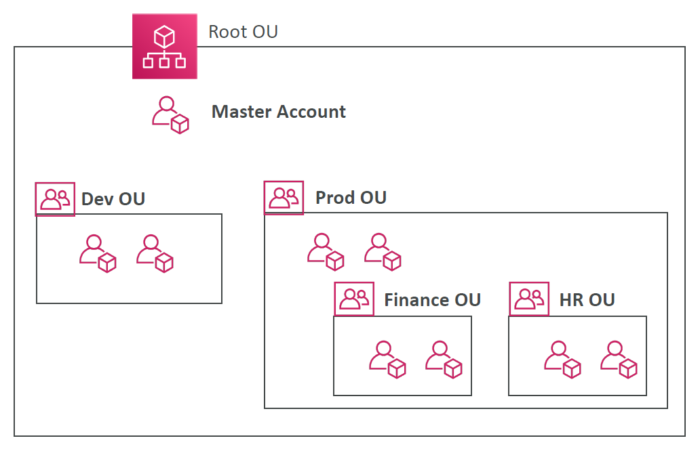

# AWS Organisations

Allows you to manage multiple AWS account under one organisation.

## Organisational Units

Each OU represents a group of AWS account.

Example AWS organisation structure is provided in the diagram below:

## Service Control Policies (SCP)

SCPs can be created to white list or blacklist actions at the OU level.

Parent SCPs Take priority over child SCPs.

## Use Cases

Good separation of resources.

- one account per business unit (department)
- one account per environment (prod, dev, test)
- one account per project
- regulatory requirements
- etc.
