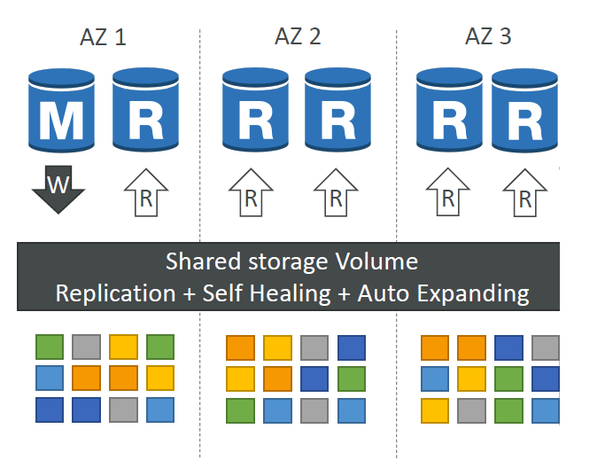
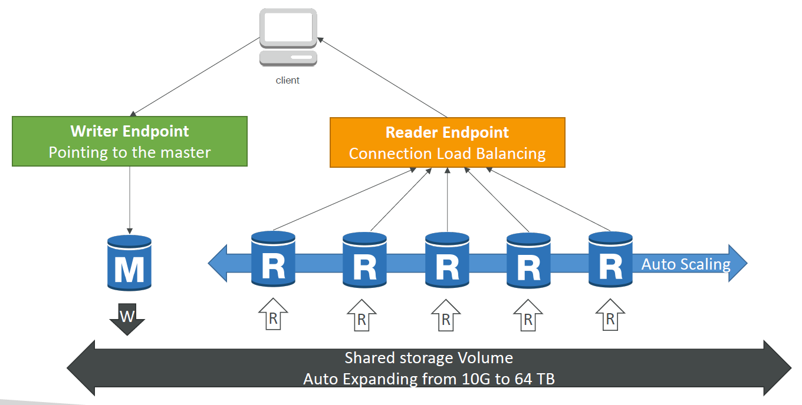

# Amazon Aurora

Amazon relation database engine that has been developed to be "cloud optimized".

Notes:
- Compatible with PostGres and MySQL
- Has 5x performance on MySQL and 3x on PostGres

## High Availability

Availability of the AWS aurora db is best described by the diagram below:

In summary: 
- Storage is: 
    - Replicated (6 copies across 3 AZs)
    - Self Healing
    - Auto Expanding

## Architecutre

Overall architecutre of the technology is as follows: 

Supports:
- a master node and up to 15 read replicas.
- definition of custome read endpoints, i.e. replicate 1 and 2 for a reporting application, replica 3 and 4 for a ETL service etc.
- multi-master nodes

## Aurora Serverless

Supports serverless application technology where you only pay per second of database use.

## Machine Learning

Automatic integration with AWS ML services.

For example you can perform basic queries such as what are the recommended products for this user to Aurora. It will query database for info, send the data to AWS ML, and the ML Model will return a set of recomended products.