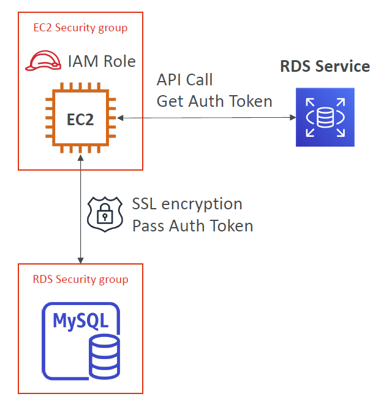

## Encryption

Two types of encryption supported:

At rest:
- AWS KMS AES-256 encryption

In-flight:
- with SSL certificates

## Snapshots

Unencrypted at-rest databases can have their snapshots encypted.

## Network 

Uses security groups to manage access.

## User Management

User access is generally managed at the database level.

Notes:
- IAM policies only control who can create and manage the RDS

### IAM

IAM can be used to managed user access for MySQL, PostGres and Aurora DB engines as per the following diagram:

## Security Groups

key ports to know

- PostgreSQL: 5432
- MySQL: 3306
- Oracle RDS: 1521
- MSSQL Server: 1433
- MariaDB: 3306 (same as MySQL)
- Aurora: 5432 (if PostgreSQL compatible) or 3306 (if MySQL compatible)