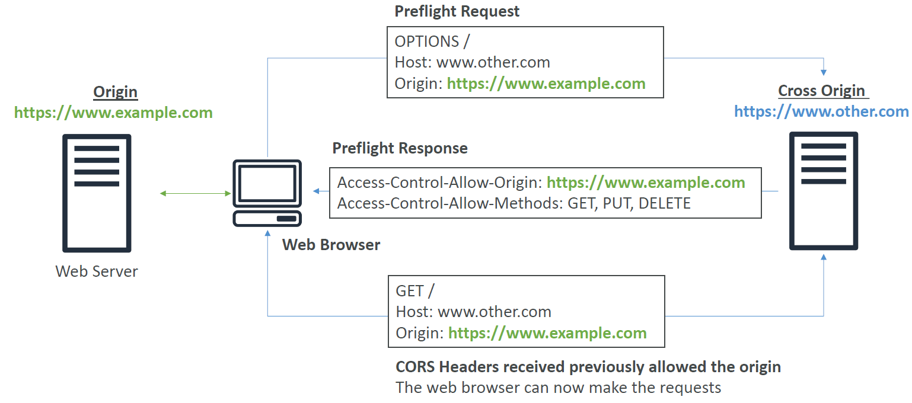

# Access

Access by users and services is governed by AWS IAM.

Access to buckets can be defined the following options:
- Bucket IAM Policies
- Access Control Lists (ACLs)
    - Obect and Bucket levels
- Presigned URLs - URL that is valid for a specific period of time and includes authentication info

*Note: Bucket Policies can be created that force encryption requirements by specifying the "conditions" property under the policy statement.*

# Encryption

S3 objects (files) can be encrypted with either:
- Server Side Encryption (SSE), or;
- Client Side Encryption (CSE)

At a base level for encryption to operate you need a private key and encryption algorithm.

- *Can be per file or per bucket.*

## Encryption Types

### SSE-S3

S3 handles all encryption operations.

- *AES-256 encryption alogrithm as standard*
- *HTTP header "x-amz-server-side-encryption": "AES256" specified with file upload to perform encryption.*

### SSE-KMS

Key Management Service (KMS) handles all encryption operations.

- *HTTP header "x-amz-server-side-encryption": "aws:kms"*
- *CMK (Customer Master Key)*

### SSE-C

Private keys managed client side and AWS performs encryption with key.

- *Specify HTTP**S** header for encryption and private key.*

### Client Side Encryption (S3)

All encryption performed client side and the encrypted file is sent to S3 for upload.

# Cross Origin Resource Sharing (CORS)

Web browser based security mechanism to allow requests from one origin to another ONLY if the other origin allows it.

Origin = A scheme (protocol), a host (domain) and a port. i.e. the following aspects of a URI.

*https*://**www.domain.com**:*port*

The process can be described by the following diagram.

Note:
- The HTTP header "Access-Control-Allow-Origin": "allow origin domain name" will be returned as a response if the **other** origin allows resource sharing from the source origin.

# Pre-signed URLs

A url with the authentication included.

Can only be generated by using the AWS CLI or SDK only.

Use cases
- only allow access to premium content from signed in users
- allow users to upload files to buckets (e.g. profile photo)

