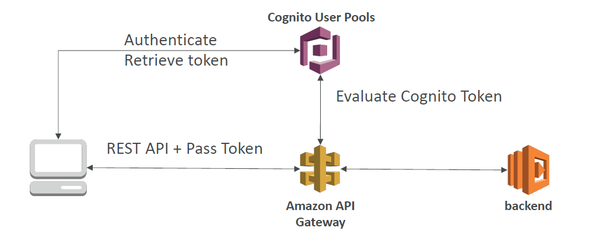

# Cognito

Service for managing user authentication.

## Cognito User Pools (CUP)

AWS identity provider and user management service. Best explained by the diagram below.

Authorisation of users via:
- username, password, MFA
- Facebook, Google etc.

Supports:
- verification of emails and phone numbers

Returns a JSON Web Token (JWT) with authentication credentials.

## Federated Identity Pools

Pools of users that have been authenticated with Federated Identities (3rd party idPs) in STS.

## Cognito Sync

Stores preferences, configuration and state of application.

