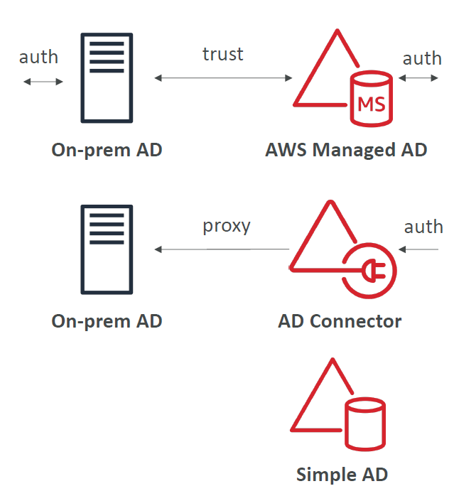

# Directory Services

Manages your Microsoft Active Directory (AD) on AWS.

## Microsoft Active Directory (AD)

Microsoft service which manages all windows based users.

Database of objects
- users
- devices (computers, printers etc.)

Notes: 
- Objects organised into tree.
- Groups of trees are called forests.

## Types

Best explained by the diagram below.

### AWS Managed Microsoft AD

AD managed by AWS. Can setup a trusted connection with a local/on-premises AD.

### AD Connector

Gateway to redirect all AD authentication to on premise AD.

Therefore users solely managed on on-premise AD.

### Simple AD

AD compatible directory managed on AWS.

No on premise AD.

