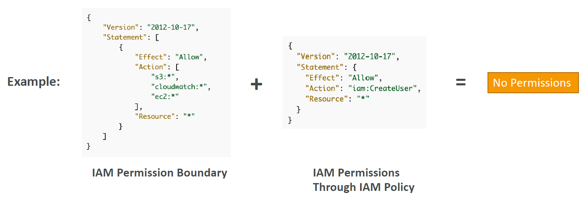

# Identity and Access Management (IAM)

AWS service to manage the security on your AWS account.

## User Management

- Root account (Person that owns the AWS account)
- Users (people within the organisation)
    - admin, developer, devop engineer, auditor, etc.
- Groups (collections of users)
    - admins, developers, devops, auditors, etc.
    - users can be assigned to multiple groups.

### Policies

Policies define what a specific User or Group is allowed to do i.e it's permissions and Users will inherit all policies from each group they are assigned to.

These policies are defined in JSON documents which are structured as follows:

```javascript
{
    // defines a specific set of permissions and who it applies to
    "Statement": [
        {    
            // allow or deny access
            "Effect": "Allow || Deny"
            // who the statement applies to - account, user, role
            "Principal" : {} || "*",
            // actions statement applies to
            "Action": [] || "*",
            // aws resource actions are applied to
            "Resource": [] || "*",
            // conditions to apply on the action
            "Condition:" {
                // example
                "StringNotEquals": {
                    // HTTP header s3:x-amz-server-side-encryption != AES256
                    "s3:x-amz-server-side-encryption": "AES256"
                }
            },
        }
    ],
}
```
- *Memorisation Tip: RAP ECCY*
- *AWS policy generator can be used to easily create policies*

In general AWS uses the **least** privilege principal - don't give more priviledges than a specific user needs.

Some example policies that might be created are:

1. administrator group policy
2. developer group policy
3. etc.

### Password Policies

Define set rules that must be adhered to by all users for their passwords. Which includes: 

- Strength rules e.g. complexity
- Whether that can be resused or not
- How often they need to be changed

Policies also include Multifactor Authentication (MFA) requirements. AWS supports two types of MFA:

- Virtual MFA Devices - Google Authenticator, Authy etc.
- Physical MFA Devices - Universal 2nd Factor (U2F) Security Keys (usb devices), etc.

## IAM Roles

IAM roles are like IAM users. However, they apply policies to AWS services.

For example giving permisions to EC2 instances to have Read access to IAM data.

## Security Tools

A set of tools to aid in managing the security of your AWS account. Two key reports are as follows:

- IAM Credentials Report
- IAM Access Advisor

## Tags

Additional metadata that can be assigned to anything to aid in categorising users or services for example.

## Permission Boundaries

Set high level boundaries for a IAM policies.

Permissions are still assigned by IAM policies. But these children to the permission boundaries.

i.e. the permission boundaries will take presedence over the policies.

**Important: Permission boundaries can only be assigned to entities. i.e. users or roles. NOT groups.**

