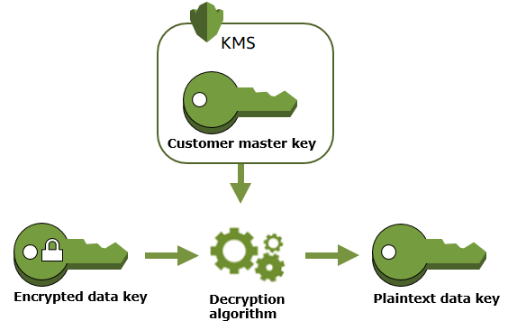

# Key Management Service (KMS)

Service to manage all your encryption keys and encryption.

## Customer Master Keys (CMK)

Two types:

### Symmetric (AES-256 keys)

Single key to encrypt and decrypt data.

### Asymmetric (RSA & ECC key pairs)

Two keys. Public key (encrypt) and private key (Decrypt). Used for sign and verify operations. e.g. TLS, SSL. e.g. encryption outside AWS.

*Note: Encrypted secrets can be stored in code / environment variables.*

### Decryption

CMKs always leave KMS encrypted. Therefore to use these keys to drypt a datasource, the key must be provided to CMKS for decryption. Then this decrypted plain text key can be used.

### CMK deletion

KMS enforces a waiting period. To delete a CMK in AWS KMS you schedule key deletion. You can set the waiting period from a minimum of 7 days up to a maximum of 30 days.

The CMK is recoverable during this period.

## Automatic Key Rotation

Automatically change underlying encyption keys every x days. Only applicable for Customer Managed CMK.

## Access

Key Policy == IAM Policy