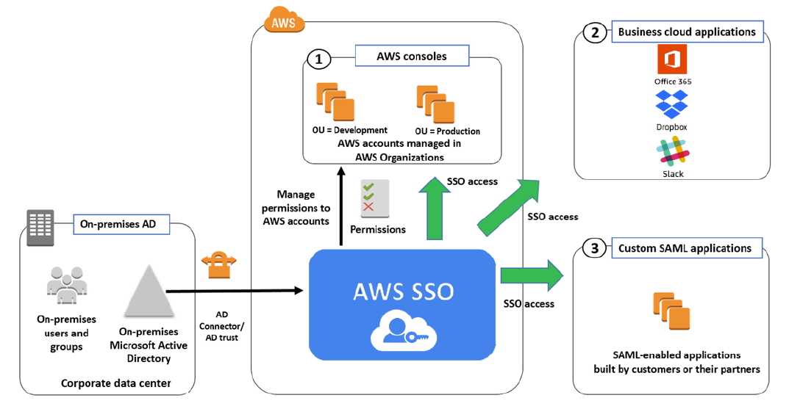

# AWS Single Sign On (SSO)

Sign in once to all your business applications (e.g. Microsoft AD, Slack, DropBox, AWS, etc.).

Essentially setting up a network of trusted idPs.

Supports anything that is SAML 2.0 compatible.

Service to manage your SSO credentials. i.e. credentials to access multiple applications

