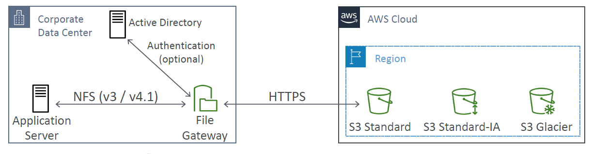

# Storage Gateways 

An interface between a local data center and aws cloud. Enables having a hybrid cloud configuration.

Requires **virtualisation on premise**.

i.e. a bridge between local storage and AWS cloud storage

## Types

### File 

- access s3 via NFS and SMB protocol
- integrated with Active Directory (AD) for user authentication

    
### Volume

- block storage using iSCSI protocol backed by S3
    - cached volumes
    - stored volumes

### Tape

- same process but with physical tapes
